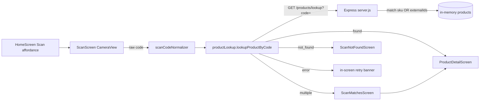
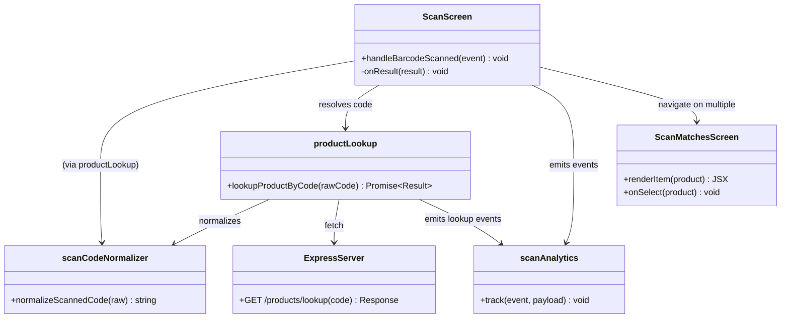
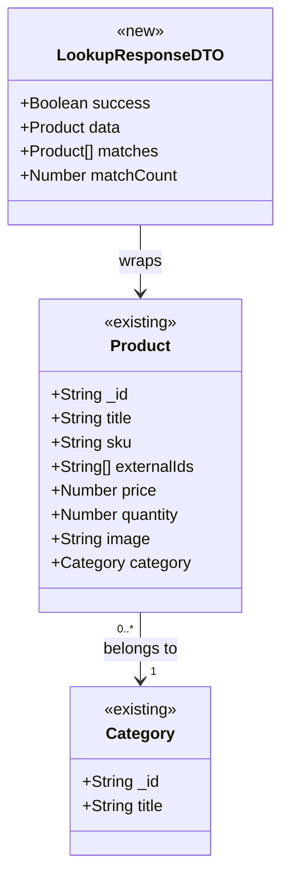

# Design: Scan-to-Product Discovery — External-ID Resolution & Multi-Match (hhamid35/ecommerce-react-native-example#4)

> Linked Jira Epic: [hhamid35/ecommerce-react-native-example#4](https://github.com/hhamid35/ecommerce-react-native-example/issues/4)
> Business spec: v1 (submitted 2026-06-28T18:29:26Z by 10babc2d-155b-4b50-bb2c-347b4161fd06)
> Architect: ALORA Design Agent

## Architecture overview

### Problem essence and value

Let a shopper scan a **physical product barcode (EAN/UPC) or QR code** — not just an internal SKU label — and land on the correct product detail, a clear "not found" state, or a short chooser when a code maps to more than one product. The verb-phrase: *resolve a scanned code to exactly one product outcome, by SKU **or** external identifier.*

The Ideation analysis is accurate against the codebase: a complete scan flow already exists end-to-end — `screens/user/HomeScreen.js` wires the "Scan" affordance (`onScanPress` → `navigation.navigate("scan")` via `components/HomeScreen/SearchBar.js`), `screens/user/ScanScreen.js` owns the camera/permission/viewfinder/cooldown/error UX, `utils/scanCodeNormalizer.js` cleans the code, `utils/productLookup.js` calls the backend, and `screens/user/ScanNotFoundScreen.js` renders the dead-end-free not-found state. The single backend, `mock-server/server.js`, serves `GET /products/lookup?code=` matching **only** `p.sku`. The remaining value is therefore concentrated in **closing the external-ID gap** and **defining multi-match behavior** — not rebuilding the flow.

### Scope and boundaries

- **In scope**: add an `externalIds` field to the product model; broaden `/products/lookup` to match SKU or any external ID (normalized); return all matches so the client can disambiguate; add a `ScanMatchesScreen` "did you mean" chooser for >1 match; add external-ID entry to the admin Add/Edit Product forms; define QR-with-URL behavior in the normalizer; formalize the scan analytics events already emitted via `console.log`; add the matching tests.
- **Out of scope**: partner/marketplace catalog IDs (treated as a later extension — see Q-1), manual code entry when the camera cannot read a label, sign-in gating of scan (scan stays open to all, consistent with current product browsing), and replacing the in-memory mock store with a real database.
- **Conservative-reuse stance**: reuse unchanged — `ScanScreen` camera/permission/error machinery, `ScanNotFoundScreen`, the `network` constant, the `{status, ...}` result contract shape, the navigation stack in `routes/Routes.js`, and the `CustomButton`/`CustomInput`/`colors` UI primitives. Extend in place — `utils/scanCodeNormalizer.js`, `utils/productLookup.js`, the `products` array + product CRUD handlers in `mock-server/server.js`, and `screens/admin/AddProductScreen.js` / `EditProductScreen.js`. Add new — one screen (`ScanMatchesScreen`) and one small util (`utils/scanAnalytics.js`). No architectural pattern is replaced.

### High-level architecture

The app is an **Expo React Native client** (React 19, React Navigation native-stack, Redux for cart) talking over `fetch` to a single **Express mock-server** that holds an in-memory `products` array. The scan feature is a thin vertical slice layered as **Screen (UI) → util (`productLookup`/`scanCodeNormalizer`) → HTTP → Express route handler → in-memory data**. This design keeps that layering intact and only widens the matching key and the return cardinality.



### Key design decisions

- **Model external IDs as `externalIds: string[]` on the product** — trade-off: a single `externalId` string is simpler but real goods often carry multiple codes (EAN-13 + a re-pack UPC). An array generalizes at near-zero cost and matches the existing free-form, schema-less in-memory store. Recommended: array of normalized strings.
- **Match by SKU OR any external ID in one endpoint, return all matches** — trade-off: a separate `/products/lookup-external` endpoint duplicates code; instead broaden the existing filter (single source of truth) and add a `matches[]` array to the 200 response so the client can disambiguate. The existing `matchCount` field is already present and silently returns `matches[0]`; this design promotes that signal to a real chooser.
- **Multi-match → `ScanMatchesScreen` chooser** — trade-off: silently showing the first match risks sending the shopper to the wrong item (a trust risk called out in the analysis); treating multi-match as not-found discards a valid result. A short "did you mean" list is the analysis's recommendation and is built from the same `BasicProductList`/`ProductCard` primitives already in the app.
- **Normalize external IDs and SKUs identically (trim + uppercase)** — reuses the existing `scanCodeNormalizer` contract so matching is casing/whitespace-insensitive on both keys, exactly as SKU matching behaves today.
- **QR-with-URL handling in the normalizer** — trade-off: today a URL is passed through verbatim and will almost always 404. Define: if the scanned value is a store URL, extract a `code`/`sku` query param or the trailing path segment as the lookup key; otherwise keep current behavior (uppercased token) so a non-URL QR still works. Non-resolvable URLs land on the existing not-found state showing the raw value.

### Alternatives considered

- **Build the scan flow from scratch** — rejected: a working flow exists; rebuilding risks regressing handled permission/not-found/network cases.
- **Match only on SKU and call the Epic done** — rejected: ignores the explicit "or external ID" requirement; shoppers scanning real printed barcodes would hit "not found" on items we sell.
- **Separate `/products/lookup-external` endpoint** — rejected: duplicates normalization and the not-found contract; one broadened filter is simpler and keeps a single matching code path.
- **Require sign-in before scanning** — rejected as default: adds friction to a discovery feature; scan stays open like product browsing.

## Affected repositories

- **hhamid35/ecommerce-react-native-example** (branch `temp_main`, type `primary`) — extends the RN client (`ScanScreen`, `productLookup`, `scanCodeNormalizer`, admin product forms, new `ScanMatchesScreen` + `scanAnalytics` util, `routes/Routes.js`) **and** the co-located Express `mock-server/server.js` (product model + `/products/lookup` + product CRUD), plus the `__tests__` Jest suite.

> All changes are confined to the single supplied `repository_targets[]` entry. No change falls outside it.

## Component-level design

### Layered architecture and dependency map



### Extension points

- `normalizeScannedCode` URL-extraction branch is the seam for future QR payload formats (deep links, GS1 Digital Link).
- The `externalIds` array leaves room for partner/marketplace IDs later (Q-1) without a further schema change.
- The `scanAnalytics.track` indirection lets a real analytics SDK replace `console.log` without touching call sites.

### Conventions in use

Pulled from the existing codebase — the implementation must conform to these, not invent new ones:

- **Module style**: ES modules, function components with hooks (`useState`/`useEffect`/`useCallback`/`useRef`), default-exported screens, named-exported utils.
- **Navigation**: `@react-navigation/native-stack`; lowercase route names registered in `routes/Routes.js` (e.g. `scan`, `scannotfound`, `productdetail`); params passed via `navigation.navigate(name, params)`.
- **HTTP**: bare `fetch` against `network.serverip` from `constants/Network.js`; responses shaped `{ success: boolean, data?, message?, code? }`.
- **Result contract**: `productLookup` returns a discriminated union `{ status: 'found' | 'not_found' | 'error', ... }`; extend with `'multiple'` rather than overloading existing variants.
- **Validation/error format (server)**: `res.status(code).json({ success: false, message, code? })`; 400 for bad input, 404 with `code: "PRODUCT_NOT_FOUND"` for misses.
- **Logging**: `console.log(eventName, payload)` on the client and `console.warn`/`console.log` on the server (e.g. existing `scan_lookup_*` and `scan_duplicate_sku`). Centralize client events in `scanAnalytics` but keep the `scan_*` event names.
- **Styling**: `StyleSheet.create` with the shared `colors` palette from `constants/`; `testID` props on every interactive/stateful element (the test suite and ALORA QA depend on them).
- **Tests**: Jest + `jest-expo`; util specs in `__tests__/` mocking `global.fetch`.

### scanCodeNormalizer (extended — `utils/scanCodeNormalizer.js`)

- **Responsibility**: turn a raw camera value into a single normalized lookup key, including QR URLs.
- **Collaborators**: none (pure function).
- **Methods**:
  - `normalizeScannedCode(raw: string): string`
    - Input validation: return `""` for null/empty/whitespace.
    - Logic: `const trimmed = String(raw).trim();` if it matches `^https?://`, attempt to extract a code — parse a `code`/`sku` query param (case-insensitive) or fall back to the last non-empty path segment; uppercase the extracted token. If extraction yields nothing usable, return the uppercased trimmed token. For non-URL input, return `trimmed.toUpperCase()` (unchanged from today).
    - Return: normalized uppercase string or `""`.
- **Transaction/concurrency boundary**: none (synchronous, pure).

### productLookup (extended — `utils/productLookup.js`)

- **Responsibility**: resolve a normalized code to a product outcome via the backend and emit analytics.
- **Collaborators**: `normalizeScannedCode`, `network`, `scanAnalytics`.
- **Methods**:
  - `lookupProductByCode(rawCode: string): Promise<Result>` where `Result =`
    - `{ status: 'found', product: object }`
    - `{ status: 'multiple', matches: object[], scannedCode: string }`  ← **new**
    - `{ status: 'not_found', scannedCode: string }`
    - `{ status: 'error', message: string }`
    - Input validation: `const code = normalizeScannedCode(rawCode); if (!code) return { status: 'error', message: 'Invalid scan' };`
    - Logic: `fetch(\`${network.serverip}/products/lookup?code=${encodeURIComponent(code)}\`)`. On `200 && success`: if `matchCount > 1` (or `Array.isArray(matches) && matches.length > 1`) return `{ status: 'multiple', matches: result.matches ?? [result.data], scannedCode: code }` and emit `scan_lookup_multiple`; else return `{ status: 'found', product: result.data }` and emit `scan_lookup_success`. On `404 && code === 'PRODUCT_NOT_FOUND'`: return `not_found` and emit `scan_lookup_not_found`. On 401/403/other non-2xx or thrown error: return `error` and emit `scan_lookup_error`.
    - Exception handling: wrap `fetch`/`json` in try/catch; map thrown errors to `{ status: 'error', message }`.
    - Return: the `Result` union above.
- **Transaction/concurrency boundary**: single async request; the caller (`ScanScreen`) holds the scan lock to prevent concurrent lookups.

### ScanScreen (extended — `screens/user/ScanScreen.js`)

- **Responsibility**: own camera/permission UX and route the lookup result to the right screen/state.
- **Collaborators**: `expo-camera` (`CameraView`, `useCameraPermissions`), `productLookup`, `scanAnalytics`, navigation.
- **Methods**:
  - `handleBarcodeScanned({ data }): Promise<void>` — unchanged guard/lock logic; on result add a `case 'multiple'` → `navigation.navigate('scanmatches', { matches: result.matches, scannedCode: result.scannedCode })`; keep `found` → `productdetail`, `not_found` → `scannotfound`, `error` → in-screen retry banner. Emit `scan_started` once when the camera mounts with granted permission.
- **Annotations/decorators**: none (RN function component).
- **Transaction/concurrency boundary**: `scanLock`/`isResolving` refs already serialize scans with a 2000 ms cooldown — retained.

### ScanMatchesScreen (new — `screens/user/ScanMatchesScreen.js`)

- **Responsibility**: present a short "did you mean" list when a scanned code matches more than one product and route the chosen one to detail.
- **Collaborators**: `route.params.matches`, `route.params.scannedCode`, navigation, `ProductCard`/`BasicProductList`, `CustomButton`, `colors`.
- **Methods**:
  - `onSelect(product): void` → `navigation.navigate('productdetail', { product })`.
  - `renderItem(product): JSX` → tappable card (`testID={\`scan-match-${product._id}\`}`).
  - Footer actions reuse the not-found pattern: "Scan again" (`navigation.replace('scan')`) and "Search manually". Header shows the `scannedCode` (monospace, `testID="scan-matches-code"`). Root `testID="scan-matches-screen"`.
- **Transaction/concurrency boundary**: none (stateless render).

### scanAnalytics (new — `utils/scanAnalytics.js`)

- **Responsibility**: single choke point for scan telemetry so event names/fields stay consistent and a real SDK can replace the console later.
- **Methods**:
  - `track(event: string, payload?: object): void` → `console.log(event, payload ?? {})`. Exposes the formalized event set: `scan_started`, `scan_permission_denied`, `scan_lookup_success`, `scan_lookup_multiple`, `scan_lookup_not_found`, `scan_lookup_error`.
- **Transaction/concurrency boundary**: none.

### Express server (extended — `mock-server/server.js`)

- **Responsibility**: hold the product model and resolve a scanned code to one or many products.
- **Methods (route handlers)**:
  - `GET /products/lookup?code=` — keep 400 guards (missing/empty code, length > 256). Compute `const normalized = String(code).trim().toUpperCase();`. Build `const matches = products.filter(p => (p.sku||'').trim().toUpperCase() === normalized || (Array.isArray(p.externalIds) ? p.externalIds : []).some(e => String(e).trim().toUpperCase() === normalized));`. If `matches.length === 0` → 404 `{ success:false, code:'PRODUCT_NOT_FOUND', message, scannedCode: normalized }`. Else → `200 { success:true, data: matches[0], matches, matchCount: matches.length }`; keep the existing `scan_duplicate_sku` warn when `matchCount > 1`.
  - `POST /product` and `POST /update-product` — accept and persist `externalIds` (normalize each entry to a trimmed uppercase string; coerce a comma-separated string to an array; default `[]`).
- **Transaction/concurrency boundary**: synchronous in-memory array operations; no DB transaction.

## UI/UX design notes

- **Scan entry & camera**: unchanged — the home-screen "Scan" affordance, viewfinder framing, "Looking up product…" overlay, permission-denied screen (Go to Settings / Back to Home), and the non-blocking network-error banner with Retry are all retained.
- **New: "Did you mean" chooser (`ScanMatchesScreen`)**: shown only when a code resolves to >1 product. Header: "More than one match for `<code>`". Body: a vertical list of tappable product cards (image, title, price) reusing `ProductCard` styling. Footer: "Scan again" + "Search manually". Empty/degenerate case (matches arrives empty) falls back to navigating to `scannotfound`.
- **Not-found state**: unchanged; continues to show the scanned code and Scan again / Search manually / Browse categories.
- **Admin product forms**: add an "External IDs (barcodes)" `CustomInput` below the SKU field in Add/Edit Product (comma-separated entry), `testID="add-product-externalids-input"` / `edit-product-externalids-input`.
- **Accessibility**: all new interactive elements carry `accessibilityLabel` and `testID`, matching existing screens.

## API schemas and contracts

The scan feature uses one read endpoint plus two admin write endpoints (existing, extended). All are JSON over HTTP against `network.serverip`. The read endpoint is **unauthenticated** (consistent with current product browsing); the write endpoints require the existing `adminMiddleware`.

```http
GET /products/lookup?code=<scannedCode>
Auth: none (public product discovery)

200 OK  (one or many matches; client disambiguates on matchCount) ->
{
  "success": true,
  "data": { "_id": "prod003", "title": "Wireless Bluetooth Headphones", "sku": "ELC-001",
            "externalIds": ["0123456789012"], "price": 89.99, "quantity": 20,
            "image": "headphones.png", "category": { "_id": "...", "title": "Electronics" } },
  "matches": [ { "_id": "prod003", "...": "..." } ],
  "matchCount": 1
}

400 Bad Request  -> { "success": false, "message": "code query parameter is required" }
400 Bad Request  -> { "success": false, "message": "code exceeds maximum length" }   // len > 256
404 Not Found    -> { "success": false, "code": "PRODUCT_NOT_FOUND",
                      "message": "No product matches the scanned code", "scannedCode": "<UPPERCASED>" }
```

```http
POST /product            (admin)   Auth: adminMiddleware
body: { "title": "string", "sku": "string", "externalIds": ["string"], "price": number,
        "quantity": number, "description": "string", "image": "string", "category": "categoryId" }
200 OK -> { "success": true, "message": "Product added successfully", "data": { ...product, "externalIds": ["..."] } }

POST /update-product?id=<id>   (admin)   Auth: adminMiddleware
body: same shape; externalIds replaces the prior array when present
200 OK -> { "success": true, "message": "Product updated successfully", "data": { ...product } }
404 Not Found -> { "success": false, "message": "Product not found" }
```

Client-side result contract (`utils/productLookup.js`):

```js
// Result union returned by lookupProductByCode(rawCode)
{ status: 'found',     product: Product }
{ status: 'multiple',  matches: Product[], scannedCode: string }   // matchCount > 1
{ status: 'not_found', scannedCode: string }
{ status: 'error',     message: string }
```

Matching is case- and whitespace-insensitive on both `sku` and every entry of `externalIds`. No event-bus contracts apply (single client + single mock-server).

## Integration patterns

- **Inbound**: the RN client calls `GET /products/lookup` via `fetch` on each accepted scan — reuses the existing `network.serverip` convention and `{ success, data, ... }` response envelope. No new transport.
- **Outbound**: none beyond the existing image-upload call in admin forms; scan emits no third-party calls. Analytics are local `console.log` via `scanAnalytics.track` (no network).
- **Idempotency / retry**: the lookup is a pure read and is naturally idempotent. The client enforces a 2000 ms `SCAN_COOLDOWN_MS` lock so a steadily-held barcode is resolved once, not repeatedly. Network errors surface a manual Retry (no auto-retry), matching today's behavior — no dedupe key needed for a GET.

## Data model changes

### Entity relationships



### Schema changes

- **Store**: in-memory `products` array in `mock-server/server.js` (no SQL/ORM). Add `externalIds: string[]` to each seeded product (e.g. seed `prod003` with a sample EAN). Existing products without the field are treated as `[]`.
- **No new tables/indexes** — the matching filter is a linear scan over the in-memory array (catalog size is tiny in the mock). If a real DB is introduced later, index `sku` and `externalIds` (multikey) — noted as a future extension, out of scope here.
- **Write handlers**: `POST /product` and `POST /update-product` read `externalIds` from the body, normalize entries (trim + uppercase, drop blanks), and default to `[]`.

### Backward-compatibility plan

Purely additive — `externalIds` is optional and defaults to `[]`. The lookup filter already short-circuits on SKU, so products lacking external IDs behave exactly as today. The 200 response gains `matches[]` while keeping `data` and `matchCount`, so the **old client keeps working** (it reads `data`); the new client reads `matchCount`/`matches`. No destructive change, no migration window required. The backfill (populating `externalIds` for catalog products) is a data task owned by the rollout step below, independent of the code deploy.

## Security and compliance considerations

- **Auth**: `GET /products/lookup` stays public (deliberate, confirmed direction — product discovery parity). Admin writes (`/product`, `/update-product`) remain behind the existing `adminMiddleware`; `externalIds` does not relax that.
- **Input hardening**: the existing `code` length cap (≤ 256) and required-param 400 are retained, mitigating oversized/empty-scan abuse. `encodeURIComponent` is already applied client-side. Recommend a lightweight per-IP rate limit on the lookup endpoint to protect the catalog service from automated scraping (flagged in the analysis as an abuse risk) — implementable as simple in-memory throttling in the mock-server.
- **Secrets**: none introduced; `network.serverip` comes from `EXPO_PUBLIC_API_URL` env (already in place), no new secret storage.
- **PII / data classification**: scanned codes and product identifiers are non-personal catalog data; no PII is logged. Analytics payloads carry only `sku`/`productId`/`scannedCode`/`matchCount` — no user identity.
- **Audit log entries**: admin add/update of `externalIds` is an admin mutation; the existing handlers log via `console.log` and should include `externalIds` in that line for traceability.
- **Regulatory constraints**: none specific; no personal data is processed by the scan path.

## Observability requirements

- **Structured logs (client, via `scanAnalytics.track`)** — formalized event set with fields:
  - `scan_started` `{}` — camera mounted with granted permission.
  - `scan_permission_denied` `{}` — permission denied screen shown.
  - `scan_lookup_success` `{ sku, productId }`.
  - `scan_lookup_multiple` `{ scannedCode, matchCount }`.
  - `scan_lookup_not_found` `{ scannedCode }`.
  - `scan_lookup_error` `{ message }`.
- **Server logs**: retain `scan_duplicate_sku` `{ sku, matchCount }` warn on multi-match; add `externalIds` to product-mutation logs.
- **Metrics (derived from the events above once an SDK is wired)**: counters `scan_lookup_total{outcome=success|multiple|not_found|error}` and a not-found rate gauge (the key product-health signal — a spike means external-ID data is missing/stale).
- **Traces**: not applicable for this client/mock-server topology (`_Not applicable — no distributed tracing in this stack._`).
- **Dashboards / alerts**: a single scan-outcome breakdown panel; alert when the `not_found` share exceeds an agreed threshold post-rollout (signals an external-ID data gap).

## Required agent skills

- `code-generation` — implement the components in the Implementation plan (normalizer/lookup/screen/server changes).
- `validation` — validate this spec before it advances to Code Generation.
- `qa` — author/extend the test pack: the new `ScanMatchesScreen` flow, multi-match and external-ID lookup paths (existing `test_scripts/*` YAML conventions apply).

## Implementation plan

> This section is the prompt for the Code Generation Agent. Phases are dependency-ordered.

### Phase 1 — Data model & backend matching (`mock-server/server.js`)

1. **Seed `externalIds`** — add `externalIds: string[]` to each product in the `products` array (give at least one product, e.g. `prod003`, a sample 13-digit EAN). Verify by `GET /products` returning the field.
2. **Broaden `/products/lookup`** — change the `matches` filter to match `sku` OR any `externalIds` entry (both normalized via trim + uppercase). Return `{ success:true, data: matches[0], matches, matchCount }`; keep 400 guards, the 404 `PRODUCT_NOT_FOUND` contract, and the `scan_duplicate_sku` warn. Verify with the integration test in Phase 5.
3. **Persist `externalIds` in writes** — `POST /product` and `POST /update-product` read, normalize (trim/uppercase, coerce comma-separated → array, drop blanks, default `[]`), and store `externalIds`. Verify the returned `data.externalIds`.

### Phase 2 — Client utils (`utils/`)

1. **`scanCodeNormalizer.js`** — implement the URL-extraction branch (`code`/`sku` query param or trailing path segment, uppercased) while preserving non-URL behavior. Verify with `__tests__/scanCodeNormalizer.test.js` cases.
2. **`scanAnalytics.js` (new)** — implement `track(event, payload)` delegating to `console.log`; export the event-name constants. Unit-test that `track` forwards name + payload.
3. **`productLookup.js`** — add the `'multiple'` branch keyed on `matchCount > 1` returning `{ status:'multiple', matches, scannedCode }`; route all outcomes through `scanAnalytics.track`. Keep `found`/`not_found`/`error` contracts. Verify in `__tests__/productLookup.test.js`.

### Phase 3 — Screens & navigation

1. **`ScanMatchesScreen.js` (new)** — build the chooser per Component-level design; reuse `ProductCard`/`CustomButton`/`colors`; add `testID`s.
2. **`routes/Routes.js`** — register `<Stack.Screen name="scanmatches" component={ScanMatchesScreen} />`.
3. **`ScanScreen.js`** — add the `case 'multiple'` → `navigate('scanmatches', { matches, scannedCode })`; emit `scan_started` on camera mount and `scan_permission_denied` on the denied path via `scanAnalytics`. Component-test the routing.

### Phase 4 — Admin forms

1. **`AddProductScreen.js` / `EditProductScreen.js`** — add an "External IDs (barcodes)" `CustomInput` (comma-separated) with state + `testID`; include `externalIds` in the submit payload; in Edit, hydrate from `product.externalIds`.

### Phase 5 — Tests & hardening

1. Extend `__tests__/productLookup.test.js` (multiple-match → `'multiple'`; external-ID resolution) and `__tests__/scanCodeNormalizer.test.js` (URL extraction). Add a mock-server-level test for the broadened lookup filter. Verify `npm test` is green.
2. (Optional) Add in-memory rate limiting to `/products/lookup`; smoke-test the preview build.

## Test strategy

### Test layers

- **Unit tests (Jest + jest-expo, `__tests__/`)**: `scanCodeNormalizer` (URL extraction, casing/whitespace, empty); `productLookup` (found, multiple, not_found, error, invalid scan — `global.fetch` mocked, matching the existing test style); `scanAnalytics.track` forwarding.
- **Integration tests (mock-server)**: `GET /products/lookup` matches by SKU, matches by external ID, returns `matchCount>1` with `matches[]`, 404 on miss, 400 on missing/oversized code.
- **Component tests**: `ScanMatchesScreen` renders all matches and navigates to `productdetail` on select; `ScanScreen` routes each result status to the right screen/state.
- **Smoke / E2E**: ALORA preview build — scan a SKU (found), scan an external-ID barcode (found), scan a duplicate code (chooser), scan an unknown code (not-found), deny permission (denied screen). Existing `test_scripts/*.yaml` conventions apply.

### Acceptance Criteria coverage

| AC# | Description | Covered by | Notes |
| --- | --- | --- | --- |
| 1 (implicit) | Launch scanning from the home "Scan" affordance | Existing HomeScreen wiring; ScanScreen component test | Unchanged |
| 2 (implicit) | Open camera and read a barcode or QR code | ScanScreen component test; `BARCODE_TYPES` retained | Unchanged |
| 3 (implicit) | Resolve a code against the catalog by SKU | `productLookup` unit + lookup integration test | Unchanged path |
| 4 (implicit) | Resolve a code against the catalog by external ID | lookup integration test (external-ID match); `productLookup` unit | **Closes the core gap** |
| 5 (implicit) | A matched scan lands on the correct product (incl. multi-match) | `ScanMatchesScreen` component test; `'multiple'` unit test | Chooser resolves ambiguity (Q-2) |
| 6 (implicit) | Unmatched scan shows not-found with next steps | Existing ScanNotFoundScreen; not_found unit + integration | Unchanged |
| 7 (implicit) | Connection/read failures handled gracefully | error-branch unit test; manual Retry banner | Unchanged |

### Performance targets and quality bars

- **Latency**: scan-to-result p95 < 1 s on the local/preview server (lookup is an in-memory linear scan).
- **Throughput**: not a concern for the mock-server at catalog scale; the client cooldown caps request rate to ≤ 1 lookup / 2 s per device.
- **Data validation rules**: code length ≤ 256 (400 otherwise); empty/whitespace scan → `'error': 'Invalid scan'` with no network call; matching is trim+uppercase-insensitive on `sku` and every `externalIds` entry.
- **Resource limits**: max `code` length 256 chars (existing guard); `externalIds` stored as trimmed strings.

### Flake risks and fixtures

- Mock `global.fetch` in `productLookup` tests (existing pattern) to remove network nondeterminism.
- `expo-camera` must be mocked in any `ScanScreen` component test (no real camera in CI).
- The 2000 ms `SCAN_COOLDOWN_MS` timer should use fake timers in component tests to avoid flakiness.

## Rollout and rollback considerations

- **Feature flag**: not strictly required — changes are additive and backward-compatible. If gating is desired, guard the `'multiple'` chooser navigation behind a simple constant (`ENABLE_SCAN_MATCH_CHOOSER`) defaulting on; without it the client falls back to today's first-match behavior.
- **Canary**: ship via the existing EAS staging profile (`build:staging:*`) and the ALORA preview build before promoting.
- **Backfill / migration ordering**: deploy the additive server + client changes first (safe with empty `externalIds`), then backfill external-ID data per product (the data dependency the analysis flags). Feature value scales with backfill coverage; no code change blocks on it.
- **Rollback plan**: revert the client/server diffs; because `externalIds` is optional and the response stays superset-compatible, an old client + new server (and vice versa) interoperate, so a partial rollback is safe. Drop the `scanmatches` route registration to disable the chooser.
- **Monitoring during rollout**: watch the `scan_lookup_not_found` rate (should fall as backfill progresses) and `scan_lookup_multiple` rate (validates the chooser is exercised); a not-found spike signals missing external-ID data, not a code defect.

## Validation summary

- **Jira Epic**: `hhamid35/ecommerce-react-native-example#4`
- **Acceptance Criteria coverage** (7 implicit ACs from the Ideation analysis, no formal ACs on the Epic):
  - AC-1/AC-2 (launch + camera read) → satisfied by the existing, retained `HomeScreen`/`ScanScreen` (Architecture overview, Component-level design).
  - AC-3 (resolve by SKU) → satisfied by the existing `productLookup` + broadened-but-backward-compatible `/products/lookup` (Phase 1–2).
  - **AC-4 (resolve by external ID)** → satisfied by `externalIds` data model + broadened lookup filter + admin form entry (Data model changes, Phases 1 & 4). *This closes the core gap.*
  - AC-5 (land on the correct product, incl. ambiguity) → satisfied by the new `'multiple'` result + `ScanMatchesScreen` chooser (Component-level design, Phase 3).
  - AC-6 (not-found with next steps) → satisfied by the unchanged `ScanNotFoundScreen`.
  - AC-7 (graceful failure) → satisfied by the retained error banner + Retry and permission-denied handling.
- **Open questions**: `Q-1` (precise definition of "external ID"), `Q-2` (confirm the multi-match chooser vs. first-match/not-found), `Q-3` (QR-payload behavior + discontinued/out-of-stock product handling). The design proceeds on the analysis's recommended interpretations (EAN/UPC printed barcode; chooser; URL-extraction with not-found fallback) and is robust to the answers — each is localized to one component.
- **Known risks accepted**: external-ID **data backfill** is a separate data dependency (feature value scales with coverage); the mock-server uses an in-memory store with a linear-scan match (acceptable at example-catalog scale; index noted as a future extension).