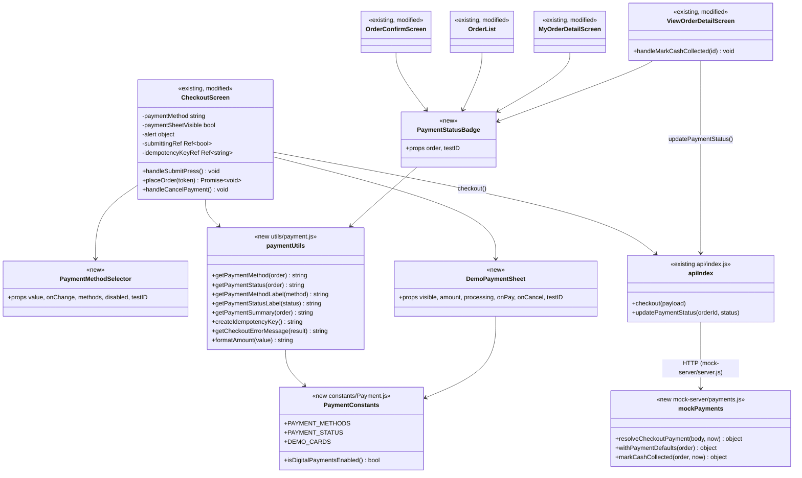
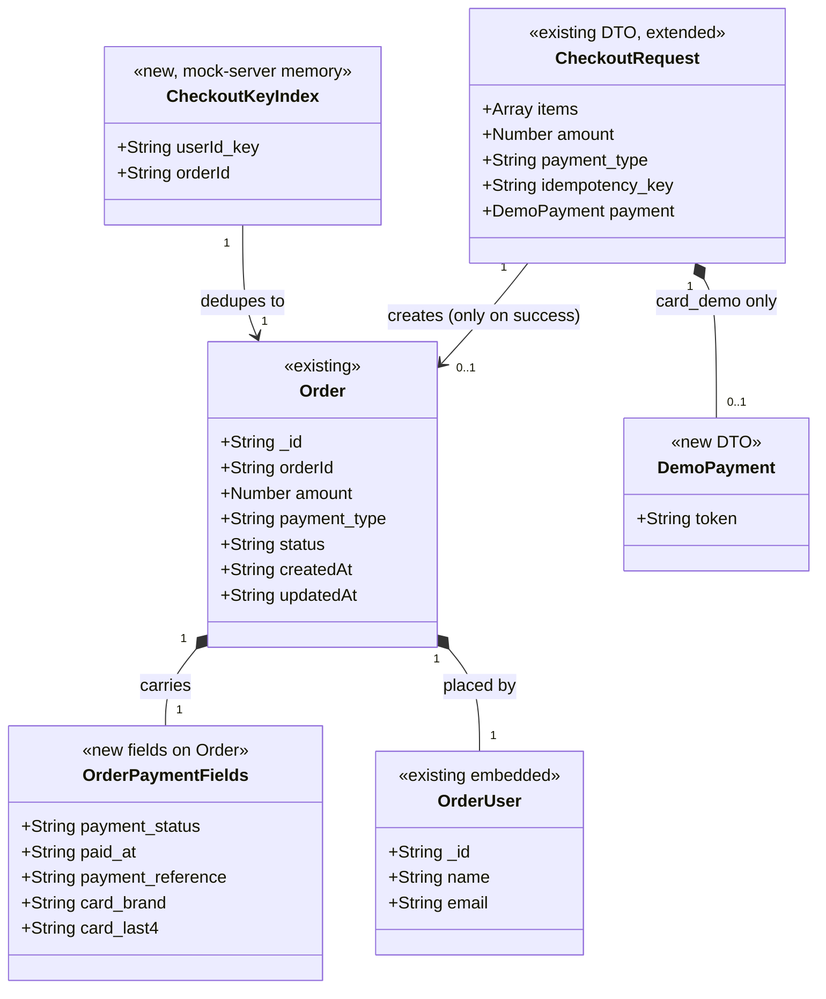

# Design: Checkout & Payments Beyond Cash-on-Delivery (hhamid35/ecommerce-react-native-example#2)

> Linked Jira Epic: [hhamid35/ecommerce-react-native-example#2](https://github.com/hhamid35/ecommerce-react-native-example/issues/2)
> Business spec: v1 (submitted 2026-09-27T09:22:55Z by 142cf940-ee02-4faa-a6b4-2f4e3a1e0f57)
> Architect: ALORA Design Agent (draft for Architect review)

## Architecture overview

### Problem essence and value

**What we're solving:** let a shopper choose between Cash on Delivery and a clearly labelled, simulated card payment at checkout. Every order records a payment method and a payment status, kept separate from delivery status, and every order surface shows them.

**Value:** a modern pay-up-front journey that can be tested without a provider contract, orders that already hold the payment state a real provider will need, and admins who can reconcile cash collection.

Requirements the business spec implies but doesn't spell out:

- **The server decides payment status.** The client must never be able to create a `paid` order by sending `payment_status: "paid"`.
- **Idempotency applies across network retries, not only double taps.** If a request times out after the server created the order, the retry must return that same order.
- **The rollout must not reach a backend that ignores payment fields.** The real Node backend (outside this repo) would silently store an unpaid `card_demo` order. The digital option therefore sits behind an environment switch that is off whenever the app points at a non-mock backend (see Rollout).
- **Totals must be exact.** Today `CheckoutScreen.handleCheckout` builds `amount` with `parseInt(product.price)`, so a $19.99 item is sent as $19. That becomes a visible error once the confirmation screen shows "Paid $X", so it is fixed here.

### Scope and boundaries

- **In scope**
  - Payment choice on `screens/user/CheckoutScreen.js`.
  - A simulated card payment sheet with three outcomes: success, decline, cancel.
  - Payment fields on orders in `mock-server/server.js`, including safe defaults for older orders.
  - Duplicate-order protection.
  - Payment display on `OrderConfirmScreen`, `OrderList` (used by `MyOrderScreen` and `ViewOrdersScreen`), `MyOrderDetailScreen` and `ViewOrderDetailScreen`.
  - An admin "Mark cash collected" action.
  - A written contract hand-off for the real backend in `mock-server/README.md`.
  - Unit and component tests.
- **Out of scope**
  - A real payment provider, real card entry, refunds, saved methods, a wallet or redirect option, delivery fees, tax, currency.
  - Changes to delivery statuses (`pending` / `shipped` / `delivered`).
  - The real Node backend's code, which lives outside `repository_targets[]`.
  - The hard-coded contact email and phone on checkout, and the known wrong total calculation `(acc + price) * qty` in `OrderList` and the two order-detail screens. These are left as they are and flagged under Rollout risks. New payment rows show the server's `order.amount` instead.
- **What is reused, extended, or new**
  - **Reused unchanged:** `api/client.js` (it already parses non-2xx JSON bodies without rejecting), `CustomButton`, `CustomAlert`, `ProgressDialog`, the Redux cart actions (`emptyCart`), the stack routes in `routes/Routes.js` (no new route), and the GET-with-query admin mutation pattern (`/admin/order-status`).
  - **Extended in place:** `payment_type` already exists on every order and is kept as the method field; `POST /checkout`; `api/index.js`; the five order screens and components.
  - **New:** two small pure modules (`constants/Payment.js`, `utils/payment.js`), three presentational components, and one mock-server helper module (`mock-server/payments.js`) so the payment rules can be unit-tested.
  - **Not replaced:** nothing. No new state library, navigation route or network layer.

### High-level architecture

The app follows **Screen → API seam (`api/index.js`) → transport (`api/client.js`) → backend (mock-server or real Node)**. Screens use local `useState` for form state and Redux only for the cart. The design stays inside that pattern:

1. **Choosing a method.** `CheckoutScreen` keeps the chosen method in local state. The new `PaymentMethodSelector` replaces the fixed "Cash On Delivery" label in the existing Payment section.
2. **Paying by demo card.** For `card_demo`, the new `DemoPaymentSheet` modal opens. The shopper picks one of two fixed test cards (no text entry exists, so no real card data can be typed). The sheet returns an opaque demo token.
3. **Placing the order.** The screen calls the existing `api.checkout()` with `payment_type`, an `idempotency_key` and `payment: { token }`.
4. **Server rules.** The mock-server (logic in `mock-server/payments.js`) accepts, declines (HTTP 402, no order created) or rejects the request. It sets `payment_status`, `paid_at` and `payment_reference` itself, and adds safe defaults to every order it returns.
5. **Reading payment state.** The screens only read the result through `utils/payment.js` helpers, which also default legacy orders on the client.

```mermaid
sequenceDiagram
  actor S as Shopper
  participant C as CheckoutScreen
  participant P as DemoPaymentSheet
  participant A as api.checkout (api/index.js → client.js)
  participant M as mock-server POST /checkout
  S->>C: select "Card (demo)" + tap "Continue to Payment"
  C->>P: visible=true, amount
  alt Cancel
    P-->>C: onCancel()
    C-->>S: CustomAlert "Payment cancelled…" (cart unchanged)
  else Pick test card + "Pay"
    P-->>C: onPay("tok_demo_success" | "tok_demo_decline")
    C->>A: { items, amount, payment_type:"card_demo", idempotency_key, payment:{token} }
    A->>M: POST /checkout (x-auth-token)
    alt token = tok_demo_success
      M-->>A: 200 { success:true, data: order{payment_status:"paid", payment_reference} }
      A-->>C: result
      C->>C: emptyCart(); replace("orderconfirm", { order })
    else token = tok_demo_decline
      M-->>A: 402 { success:false, code:"payment_declined" } (no order stored)
      A-->>C: result
      C-->>S: CustomAlert decline message; new idempotency key; cart unchanged
    end
  end
```

The COD path is unchanged apart from the extra fields: tap "Submit Order", call `POST /checkout` with `payment_type: "cod"`, and the order is created with `payment_status: "pending"`. Admins settle it later with `GET /admin/payment-status?orderId=&status=paid`.

### Key design decisions

- **Keep `payment_type` as the method field and add `payment_status` next to it.** Every order and the checkout payload already use `payment_type` (`mock-server/server.js` seeds, `CheckoutScreen` sends `"cod"`). Renaming it would break the real backend and existing records. The new fields follow its snake_case style: `payment_status`, `paid_at`, `payment_reference`, `card_brand`, `card_last4`.
- **Simulate the payment on the server, not only in the client.** The outcome is decided by `mock-server/payments.js` from the demo token. The trade-off is one extra field in the request. In return, the client can never make an order "paid" on its own, and the contract (token in, server-set status out) already has the shape a real provider integration (token or payment-intent) will need.
- **A decline creates no order.** This follows the business spec's working assumption for Q-2 (BR-6, AC-4). The server responds 402 and stores nothing, and the cart stays in Redux. If the Architect instead chooses "record a Failed order" (Q-2), the `failed` status value already exists and only `resolveCheckoutPayment` and the confirm/retry UI change.
- **Cancel happens only on the client.** Cancelling closes the sheet before any request is sent. Nothing reaches the server, so nothing can be charged or duplicated (AC-4, AC-11).
- **Fixed test cards instead of text inputs.** BR-3 forbids collecting real credentials. With no `TextInput` in the sheet, nobody can type a real card number, and nothing needs to be masked, stored or kept out of logs.
- **Idempotency key plus an in-flight guard.** A `useRef` flag blocks re-entry within one render cycle, where button `disabled` state can lag. A per-attempt `idempotency_key` (in the body, keyed per user on the server) makes network retries safe. The key is regenerated only after a definitive server rejection, and kept after a network error so a retry returns the order that may already exist (BR-12).
- **COD settlement is an explicit admin action.** It is a separate endpoint mirroring `/admin/order-status`, and it doesn't happen automatically on delivery. Payment and delivery stay independent (Risk: "Confusing paid with delivered"). This is the recommended answer to Q-3.
- **Default legacy orders in both places.** The server fills in payment fields on every order it returns (`withPaymentDefaults`) and the client repeats the same rule in `utils/payment.js`. A delivered legacy order shows as `paid`, anything else as `pending` (BR-13). The client repeat covers the real backend until it adopts the contract.
- **Environment switch for the digital option.** `EXPO_PUBLIC_DIGITAL_PAYMENTS` follows the existing `EXPO_PUBLIC_API_URL` convention in `api/config.js`. There is no remote-config system in the repo.

### Alternatives considered

- **Payment decided only on the client** (the app flips status after a fake delay). Rejected: the client would be trusted to assert "paid", it can't be exercised against the backend, and it would have to be rewritten for a real provider.
- **A separate `POST /payments` step before `POST /checkout`.** Rejected for now: it doubles the requests and needs a pending-payment record to link to the order, which is closer to Q-2's "record failed attempts" option. It stays possible later behind the same `payment.token` field.
- **Record every declined attempt as an order with `payment_status: "failed"`.** Deferred to Q-2. Order history would fill up with failed orders, and a retry-this-order flow would be needed.
- **A card form with masked text inputs.** Rejected: the risk that people type real numbers (BR-3, Risk 1) outweighs the extra realism.
- **Auto-mark COD as Paid on Delivered.** Offered as an option in Q-3, not the default, because it merges two statuses the business spec wants kept apart.
- **A new "PaymentScreen" route.** Rejected: the business spec's constraint says to replace the existing Payment section rather than add a screen. A modal also avoids back-stack problems when going back mid-payment.

## Affected repositories

- **hhamid35/ecommerce-react-native-example** (branch `main`, type `primary`). Changes to the app (checkout payment choice, demo payment sheet, payment display on confirmation, user order list and detail, admin order list and detail, admin cash-collected action) and to the bundled `mock-server/` (payment fields, simulated outcomes, idempotency, admin payment-status endpoint, contract documentation).
- The real Node backend (default `http://localhost:3000`) is **not** in `repository_targets[]`. This design only produces a written contract hand-off (`mock-server/README.md` → "Payment contract") and a client-side fallback for legacy orders. No code outside this repository is changed.

## Component-level design

### Layered architecture and dependency map



### Extension points

- `PAYMENT_METHODS` / `PAYMENT_METHOD_OPTIONS` in `constants/Payment.js` are the only list of methods. Adding a `wallet_demo` or `redirect_demo` later means adding an entry there, a branch in `resolveCheckoutPayment`, and a sheet component. `PaymentMethodSelector` renders whatever list it is given.
- `payment.token` in the checkout request is the slot a real provider's payment token or intent id will use.
- `PAYMENT_STATUS.FAILED` is defined and has a label and colour now, even though nothing creates it yet (reserved for the Q-2 alternative).
- `GET /admin/payment-status` validates `status` against a list, which currently allows only `paid`. `refunded` can be added later.

### Conventions in use

- **Components:** function components with hooks, default export, and an `index.js` re-export (`export { default } from "./X";`) as in `components/CustomButton/index.js`. Styles go in a `StyleSheet.create` at the bottom of the file. Colours come only from `colors` in `constants`.
- **State:** local `useState` for screen and form state. Redux only for the cart, through `bindActionCreators(actionCreaters, dispatch)`. No new Redux slice is added.
- **API:** screens call only named operations from `import * as api from "../../api"`. The transport returns the parsed body for any HTTP status, and callers branch on `result.success`. Network failures reject, and `.catch()` handles them.
- **Errors in UI:** `CustomAlert` with `message` and `type` (`"error"` / `"success"`), as in `ViewOrderDetailScreen`. Progress uses `ProgressDialog` with a `label`.
- **Test hooks:** kebab-case `testID`s prefixed by the screen (`checkout-…`, `order-confirm-…`, `my-order-detail-…`, `view-order-detail-…`). Child ids are built as `${testID}-suffix`. **Every existing testID stays, with its current text.**
- **Accessibility:** new interactive elements set `accessibilityRole`, `accessibilityState` and `accessibilityLabel`. This is a new but minimal convention, required by BR-16.
- **Mock-server:** CommonJS `require`. Responses use the shape `{ success, message, data }`. Errors use `res.status(code).json({ success:false, message, code })`. Admin routes use `adminMiddleware`, user routes `authMiddleware`.
- **Logging:** `console.log` with a short prefix (the project has no logging library). See Observability requirements.
- **Documentation:** a one-line `//` comment above each method, matching the existing "//method to …" style. No JSDoc.

### constants/Payment.js (new)

- **Responsibility:** the single source of payment enums, demo test cards and the feature switch.
- **Exports (named):**
  - `PAYMENT_METHODS = { COD: "cod", CARD_DEMO: "card_demo" }`
  - `PAYMENT_STATUS = { PENDING: "pending", PAID: "paid", FAILED: "failed" }`
  - `DEMO_CARDS = [{ token: "tok_demo_success", brand: "Visa", last4: "4242", label: "Test card •••• 4242", hint: "Payment succeeds" }, { token: "tok_demo_decline", brand: "Visa", last4: "0002", label: "Test card •••• 0002", hint: "Payment is declined" }]`
  - `PAYMENT_METHOD_OPTIONS = [{ value: "cod", label: "Cash on Delivery", description: "Pay in cash when your order arrives" }, { value: "card_demo", label: "Card (demo)", description: "Simulated card payment — no money is charged" }]`
  - `isDigitalPaymentsEnabled(): boolean`
    - Read `process.env.EXPO_PUBLIC_DIGITAL_PAYMENTS` with the same `typeof process !== "undefined" && process.env` guard as `api/config.js`.
    - `"true"` returns `true` and `"false"` returns `false`.
    - When unset, return `true` only if `process.env.EXPO_PUBLIC_API_URL` is also unset (the app is on the default mock-server). Otherwise return `false`.

### utils/payment.js (new)

- **Responsibility:** pure functions that normalise and label an order's payment state, so every screen shows the same thing (AC-7, AC-8, AC-9, AC-10).
- **Collaborators:** `constants/Payment.js` only. No React, no I/O.
- **Methods:**
  - `getPaymentMethod(order): "cod" | "card_demo"` returns `order?.payment_type` if it is one of `PAYMENT_METHODS`, otherwise `"cod"`.
  - `getPaymentStatus(order): "pending" | "paid" | "failed"` returns `order?.payment_status` if it is one of `PAYMENT_STATUS`. Otherwise (legacy or unknown) it returns `"paid"` when `order?.status === "delivered"`, else `"pending"`.
  - `getPaymentMethodLabel(method): string` maps `cod` to "Cash on Delivery" and `card_demo` to "Card (demo)". Anything else gives "Cash on Delivery".
  - `getPaymentStatusLabel(status): string` maps `pending` to "Pending", `paid` to "Paid" and `failed` to "Failed". Anything else gives "Pending".
  - `getPaymentSummary(order): string` returns one of:

    | Method | Status | Summary |
    | --- | --- | --- |
    | `card_demo` | `paid` | "Paid by card (demo)" |
    | `card_demo` | `failed` | "Card payment failed (demo)" |
    | `cod` | `pending` | "Pay cash on delivery" |
    | `cod` | `paid` | "Paid in cash" |
    | any other combination | | `${methodLabel} · ${statusLabel}` |

  - `formatAmount(value): string` returns `` `${Number(value || 0).toFixed(2)}$` ``. The trailing `$` matches the existing `{totalCost}$` display style.
  - `createIdempotencyKey(): string` returns `` `chk-${Date.now().toString(36)}-${Math.random().toString(36).slice(2, 10)}` ``. It adds no new dependency, and uniqueness only has to hold per user and attempt.
  - `getCheckoutErrorMessage(result): string`:

    | `result?.code` | Message |
    | --- | --- |
    | `payment_declined` | "Your demo card was declined. No order was placed and your cart is unchanged. Try again or choose Cash on Delivery." |
    | `invalid_payment_method` / `invalid_payment_token` | "This payment option isn't available right now. Please choose Cash on Delivery." |
    | `network_error` (set by the caller in `.catch`) | "We couldn't reach the store. Check your connection and try again — you won't be charged twice." |
    | anything else | `result?.message` if it is a string, else "We couldn't place your order. Please try again." |

### components/PaymentMethodSelector/PaymentMethodSelector.js (+ index.js) (new)

- **Responsibility:** a radio group for choosing exactly one payment method (BR-1).
- **Props:** `{ value: string, onChange: (method) => void, options = PAYMENT_METHOD_OPTIONS, disabled = false, testID }`.
- **Rendering:**
  - The wrapper is a `View` with `accessibilityRole="radiogroup"` and `testID={testID}`.
  - Each option is a `TouchableOpacity` styled like the existing checkout `list` rows (white, height ≥ 50, bottom border `colors.light`). Set `accessibilityRole="radio"`, `accessibilityState={{ checked: value === o.value, disabled }}`, `accessibilityLabel={`${o.label}. ${o.description}`}` and `testID={`${testID}-option-${o.value}`}`.
  - Each row shows an Ionicons `radio-button-on` / `radio-button-off` icon (size 22, `colors.primary` when checked, `colors.muted` otherwise), the label in bold, and the description in muted 12px text.
- **Behaviour:** `onPress` calls `onChange(o.value)` unless `disabled` is set.

### components/DemoPaymentSheet/DemoPaymentSheet.js (+ index.js) (new)

- **Responsibility:** the simulated card payment step (BR-2, BR-3) with success, decline and cancel outcomes.
- **Props:** `{ visible: bool, amount: number, processing: bool, onPay: (token) => void, onCancel: () => void, testID = "demo-payment-sheet" }`.
- **State:** `selectedToken` (string | null), reset to `null` whenever `visible` becomes `true` (`useEffect` on `visible`).
- **Rendering:** a React Native `Modal` (`animationType="slide"`, `transparent`) with the same centred white card style as the checkout address modal (`modelBody` / `modelAddressContainer`). Contents in order:
  1. Title "Card payment", `testID={`${testID}-title`}`.
  2. A demo banner reading "Demo — no money is charged. Use a test card below." on a `colors.warning` background, with `accessibilityRole="alert"` and `testID={`${testID}-demo-banner`}`.
  3. The amount line "Amount: {formatAmount(amount)}", `testID={`${testID}-amount`}`.
  4. One radio row per `DEMO_CARDS` entry, showing the label and hint. Use `testID={`${testID}-card-${card.last4}`}`, `accessibilityRole="radio"` and `accessibilityState={{ checked, disabled: processing }}`. **No `TextInput` anywhere.**
  5. `CustomButton` with text "Pay {formatAmount(amount)}" and `testID={`${testID}-pay-btn`}`, disabled while `!selectedToken || processing`. `onPress` calls `onPay(selectedToken)`.
  6. `CustomButton` with text "Cancel" and `testID={`${testID}-cancel-btn`}`, disabled while `processing`. `onPress` calls `onCancel()`.
- **Modal `onRequestClose`** (Android back button or web Esc) calls `onCancel()` only when `!processing`, so going back mid-request neither cancels nor duplicates it (BR-12).

### components/PaymentStatusBadge/PaymentStatusBadge.js (+ index.js) (new)

- **Responsibility:** a compact, readable display of an order's payment method and status (AC-8, AC-9, AC-10).
- **Props:** `{ order, testID, showSummary = false }`.
- **Rendering:**
  - A row `View` with `accessibilityLabel={`Payment: ${methodLabel}, ${statusLabel}`}`.
  - `Text` with the method label (`testID={`${testID}-method`}`).
  - A pill `Text` with the status label (`testID={`${testID}-status`}`). Its background is `colors.success` for paid, `colors.warning` for pending and `colors.danger` for failed; its text is `colors.dark`.
  - When `showSummary` is set, a second `Text` with `getPaymentSummary(order)` (`testID={`${testID}-summary`}`).
- All values come from `utils/payment.js`, so a legacy order never renders blank.

### screens/user/CheckoutScreen.js (modified)

- **New imports:** `useRef` from react; `PaymentMethodSelector`, `DemoPaymentSheet` and `CustomAlert`; `{ PAYMENT_METHODS, PAYMENT_METHOD_OPTIONS, isDigitalPaymentsEnabled }` from `../../constants/Payment`; `{ createIdempotencyKey, getCheckoutErrorMessage, getPaymentMethodLabel }` from `../../utils/payment`.
- **New state:**
  - `const digitalEnabled = isDigitalPaymentsEnabled();`
  - `const [paymentMethod, setPaymentMethod] = useState(PAYMENT_METHODS.COD);` (COD is the default, AC-1 and AC-5)
  - `const [paymentSheetVisible, setPaymentSheetVisible] = useState(false);`
  - `const [alert, setAlert] = useState({ message: "", type: "error" });`
  - `const submittingRef = useRef(false);`
  - `const idempotencyKeyRef = useRef(createIdempotencyKey());`
  - `const [loadingLabel, setLoadingLabel] = useState("Placing Order...");`
- **Methods:**
  - `buildOrderPayload(token)` returns `{ items, amount, discount: 0, payment_type: paymentMethod, idempotency_key: idempotencyKeyRef.current, country, status: "pending", city, zipcode, shippingAddress: streetAddress }` and adds `payment: { token }` only when `paymentMethod === PAYMENT_METHODS.CARD_DEMO`. `items` is built as today. **`amount` is calculated with `Number(product.price) * Number(product.quantity)`**, rounded with `Math.round(x * 100) / 100` (this fixes the `parseInt` truncation).
  - `handleSubmitPress()`:
    1. If `submittingRef.current` is set, return.
    2. Clear the alert with `setAlert({ message: "", type: "error" })`.
    3. If `paymentMethod === CARD_DEMO`, `setPaymentSheetVisible(true)`. Otherwise call `placeOrder(null)`.
  - `placeOrder(token)`:
    1. If `submittingRef.current` is set, return. Otherwise set it to `true`.
    2. Set the loading label to "Processing payment..." for card or "Placing Order..." for COD, and call `setIsloading(true)`.
    3. Call `api.checkout(buildOrderPayload(token))`.
    4. `.then(result)`:
       - If `result.success == true`: call `emptyCart("empty")`, `setPaymentSheetVisible(false)`, then `navigation.replace("orderconfirm", { order: result.data })`.
       - Otherwise: `idempotencyKeyRef.current = createIdempotencyKey()` (the server definitively rejected it, so the next attempt is new), `setPaymentSheetVisible(false)` and `setAlert({ message: getCheckoutErrorMessage(result), type: "error" })`. **The cart is not touched.**
    5. `.catch(error)`: keep the same idempotency key so a retry dedupes, `setPaymentSheetVisible(false)`, `setAlert({ message: getCheckoutErrorMessage({ code: "network_error" }), type: "error" })`, and `console.log("[payment] checkout_error", { method: paymentMethod, reason: "network" })`.
    6. `.finally()`: `submittingRef.current = false; setIsloading(false);`
  - `handleCancelPayment()`: if `submittingRef.current` is set, return. Otherwise `setPaymentSheetVisible(false)`, set the alert to "Payment cancelled. Your cart is unchanged — try again or choose Cash on Delivery." with type `"error"`, and log `console.log("[payment] payment_cancelled", { method: "card_demo" })`.
- **Changes to the render tree:**
  - `<ProgressDialog visible={isloading} label={loadingLabel} />`.
  - Place `<CustomAlert message={alert.message} type={alert.type} testID="checkout-alert" />` directly below the top bar.
  - The back button's `onPress` returns early when `isloading` is set.
  - Payment section: keep `checkout-payment-heading`. Keep the `checkout-method-label` / `checkout-method-value` row, but `checkout-method-value` now shows `getPaymentMethodLabel(paymentMethod)`, which is "Cash on Delivery" by default. Below it, when `digitalEnabled`, render `<PaymentMethodSelector value={paymentMethod} onChange={setPaymentMethod} options={PAYMENT_METHOD_OPTIONS} disabled={isloading} testID="checkout-payment-selector" />`. When `!digitalEnabled`, render the section exactly as today.
  - The submit button keeps `testID="checkout-submit-btn"`. Its text is "Submit Order" for COD and "Continue to Payment" for card. It keeps the address-required disabled condition, and is also disabled while `isloading`. `onPress` calls `handleSubmitPress`.
  - Add `<DemoPaymentSheet visible={paymentSheetVisible} amount={totalCost + deliveryCost} processing={isloading} onPay={(token) => placeOrder(token)} onCancel={handleCancelPayment} testID="checkout-payment-sheet" />` next to the address modal.
- **Concurrency:** `submittingRef` serialises submissions within the screen. The server-side idempotency key covers retries after lost responses.

### screens/user/OrderConfirmScreen.js (modified)

- **Signature:** `({ navigation, route })`, with `const order = route?.params?.order;`.
- **Rendering:** keep `order-confirm-image`, `order-confirm-text` and `order-confirm-home-btn` unchanged. When `order` is present, render a white rounded details card (`testID="order-confirm-details"`) between the text and the button, containing:
  - "Order # {order.orderId}" (`order-confirm-order-id`)
  - "Total: {formatAmount(order.amount)}" (`order-confirm-total`)
  - `<PaymentStatusBadge order={order} showSummary testID="order-confirm-payment" />`, which produces `order-confirm-payment-method`, `order-confirm-payment-status` and `order-confirm-payment-summary`
  - For card orders with a `payment_reference`: "Reference: {payment_reference}" (`order-confirm-payment-reference`)
- **Fallback:** when there is no `order` param (for example a deep link), show only the existing content.

### components/OrderList/OrderList.js (modified)

- Add one row after the existing Quantity/Total row: `<PaymentStatusBadge order={item} testID={testID ? `${testID}-payment` : undefined} />`.
- The existing `${testID}-status` text (delivery status) keeps its value. Prefix it with a visible "Delivery: " label as a **separate** `Text` so the testID's text content stays `item?.status`.
- Both `MyOrderScreen` and `ViewOrdersScreen` get this automatically (AC-8, AC-9).

### screens/user/MyOrderDetailScreen.js (modified)

- Add a "Payment" section after "Order Info":
  - Heading `my-order-detail-payment-heading`.
  - A container with `<PaymentStatusBadge order={orderDetail} showSummary testID="my-order-detail-payment" />`.
  - When set: `paid_at` as "Paid on {dateFormat(paid_at)}" (`my-order-detail-paid-date`), `payment_reference` (`my-order-detail-payment-reference`), and for card orders "{card_brand} •••• {card_last4}" (`my-order-detail-payment-card`).
  - "Amount: {formatAmount(orderDetail?.amount)}" (`my-order-detail-payment-amount`).
- Nothing else changes.

### screens/admin/ViewOrderDetailScreen.js (modified)

- **New state:** `const [paymentOrder, setPaymentOrder] = useState(orderDetail);`, the local copy the badge reads so it updates after settlement.
- **New method:** `handleMarkCashCollected(id)`:
  1. `setIsloading(true); setError(""); setAlertType("error");`
  2. Call `api.updatePaymentStatus(id, "paid")`.
  3. `.then(result)`: on success, `setPaymentOrder(result.data)`, `setAlertType("success")` and `setError("Cash collected — payment marked as Paid")`. Otherwise `setError(result?.message || "Could not update payment status")`.
  4. `.catch`: `setError("Could not update payment status")`.
  5. `.finally`: `setIsloading(false)`.
- **Rendering:** add a "Payment" section after "Order Info" (heading `view-order-detail-payment-heading`):
  - `<PaymentStatusBadge order={paymentOrder} showSummary testID="view-order-detail-payment" />`, plus paid date, reference and card line, as on the user detail screen, using the `view-order-detail-…` testID prefix.
  - "Amount: {formatAmount(paymentOrder?.amount)}".
  - When `getPaymentMethod(paymentOrder) === "cod" && getPaymentStatus(paymentOrder) === "pending"`: `<CustomButton text="Mark cash collected" onPress={() => handleMarkCashCollected(orderDetail?._id)} testID="view-order-detail-mark-paid-btn" />`.
- The delivery-status dropdown and "Update" button stay unchanged. `handleUpdateStatus` also stays unchanged, except that after a success it should call `setPaymentOrder(result.data)` when `result.data` is present, so the badge reflects the server's returned order.

### api/index.js (modified)

- Add under `// ---- Orders ----`: `export const updatePaymentStatus = (orderId, status) => get(`/admin/payment-status?orderId=${q(orderId)}&status=${q(status)}`);`
- `checkout` is unchanged; the payload simply gains fields.

### mock-server/payments.js (new, CommonJS)

- **Responsibility:** the payment rules for the demo backend, kept pure so Jest can test them from `__tests__/`.
- **Exports:**
  - `PAYMENT_METHODS = ["cod", "card_demo"]`, `PAYMENT_STATUSES = ["pending", "paid", "failed"]`, `ADMIN_SETTABLE_PAYMENT_STATUSES = ["paid"]`.
  - `DEMO_TOKENS = { tok_demo_success: { outcome: "success", card_brand: "Visa", card_last4: "4242" }, tok_demo_decline: { outcome: "decline", card_brand: "Visa", card_last4: "0002" } }`.
  - `resolveCheckoutPayment(body, now = new Date()) → { ok: true, fields } | { ok: false, httpStatus, code, message }`:
    - `method = body?.payment_type || "cod"`. If it is not in `PAYMENT_METHODS`, return `{ ok:false, httpStatus:400, code:"invalid_payment_method", message:"Unsupported payment method" }`.
    - For `cod`: `fields = { payment_type:"cod", payment_status:"pending", paid_at:null, payment_reference:null, card_brand:null, card_last4:null }`.
    - For `card_demo`:
      - `demo = DEMO_TOKENS[body?.payment?.token]`. If missing, return `{ ok:false, httpStatus:400, code:"invalid_payment_token", message:"Invalid demo payment token" }`.
      - If `demo.outcome === "decline"`, return `{ ok:false, httpStatus:402, code:"payment_declined", message:"Your demo card was declined. No order was placed." }`.
      - Otherwise `fields = { payment_type:"card_demo", payment_status:"paid", paid_at: now.toISOString(), payment_reference: "DEMO-" + <8 uppercase hex chars from uuidv4()>, card_brand, card_last4 }`.
    - **Any client-supplied `payment_status`, `paid_at` or `payment_reference` is ignored.**
  - `withPaymentDefaults(order) → order` returns a shallow copy with `payment_type` (default `"cod"`), `payment_status` (a valid existing value, else `"paid"` if `status === "delivered"`, else `"pending"`), and `paid_at`, `payment_reference`, `card_brand`, `card_last4` (default `null`). It never mutates its input.
  - `markCashCollected(order, status, now = new Date()) → { ok:true, order } | { ok:false, httpStatus, code, message }`:
    - A `status` not in `ADMIN_SETTABLE_PAYMENT_STATUSES` gives 400 `invalid_payment_status`.
    - A normalised method other than `cod` gives 409 `not_cash_on_delivery`.
    - An order that is already `paid` gives `{ ok:true, order }` unchanged (idempotent).
    - Otherwise it mutates and returns the stored order with `payment_status:"paid"`, `paid_at: now.toISOString()` and `updatedAt: now.toISOString()`.

### mock-server/server.js (modified)

- Add `const payments = require("./payments");` and a map `const checkoutsByKey = new Map(); // `${userId}:${idempotency_key}` -> order _id`.
- **`POST /checkout`:**
  1. Keep the existing empty-cart 400.
  2. If `idempotency_key` is a non-empty string (≤ 100 chars) and `checkoutsByKey` holds `${req.user._id}:${key}` pointing at an existing order, return `200 { success:true, message:"Order already placed", duplicate:true, data: withPaymentDefaults(existing) }`.
  3. `const p = payments.resolveCheckoutPayment(req.body)`. If `!p.ok`, log and `return res.status(p.httpStatus).json({ success:false, code:p.code, message:p.message })`. No order is stored.
  4. Build `newOrder` as today and spread `...p.fields`. `amount` is `Number(amount) || 0`.
  5. Push the order, store the key mapping, log, and respond `{ success:true, message:"Order placed successfully", data:newOrder }`.
- **`GET /orders`, `GET /admin/orders`:** `data: filtered.map(payments.withPaymentDefaults)`.
- **`GET /admin/order-status`:** unchanged logic. The response `data` goes through `withPaymentDefaults(order)`.
- **New `GET /admin/payment-status`** (`adminMiddleware`):
  - Missing `orderId` or `status` gives 400.
  - If the order is not found, 404 `{ success:false, message:"Order not found" }`.
  - `const r = payments.markCashCollected(order, status)`. On failure, `res.status(r.httpStatus).json({ success:false, code:r.code, message:r.message })`. On success, `{ success:true, message:"Payment status updated to paid", data: withPaymentDefaults(r.order) }`.
- **Seed orders:** leave `order001`–`order003` **without** payment fields so the legacy-default path is exercised (order003 shows as delivered/Paid, the others as Pending).
- **Startup route listing:** add `GET /admin/payment-status?orderId=&status=  (admin)`.

## UI/UX design notes

- **Checkout Payment section (AC-1, AC-5):** the heading "Payment" stays. The "Method" row now shows the selected method. Below it are two radio rows: "Cash on Delivery — Pay in cash when your order arrives" (pre-selected) and "Card (demo) — Simulated card payment — no money is charged". COD shoppers see no new step, and the button still reads "Submit Order". Choosing card changes the button text to "Continue to Payment".
- **Demo payment sheet (AC-2, BR-3):**
  - A bottom-slide modal with the same visual language as the address modal.
  - A prominent yellow (`colors.warning`) banner at the top: "Demo — no money is charged. Use a test card below."
  - Two selectable test cards, each with a plain-language hint of its outcome ("Payment succeeds" / "Payment is declined"). There are no text fields.
  - A primary "Pay 129.97$" button and a secondary "Cancel" button.
  - While processing, both buttons and the card rows are disabled, the ProgressDialog reads "Processing payment...", and the Android back button does nothing.
- **Failure feedback (AC-4, BR-11):** the sheet closes and a `CustomAlert` (error style) appears at the top of checkout. It carries the specific decline, cancel, network or server message from `getCheckoutErrorMessage`. The cart summary and address stay filled in, and the shopper can tap the button again or switch to COD.
- **Confirmation (AC-7):** the success image and "Back to Home" stay. A new details card shows "Order # ORD-…", "Total: 129.97$", the method, a status pill (green Paid or yellow Pending), a summary line ("Paid by card (demo)" or "Pay cash on delivery"), and the reference for card orders.
- **Order list cards (AC-8, AC-9):** a new row shows "Card (demo)" or "Cash on Delivery" with a coloured status pill. The existing bottom row shows "Delivery: pending", so the two statuses are clearly separate.
- **Order detail (user and admin):** a new "Payment" section shows the method, status pill, summary, amount, paid date, reference and demo card brand/last-4. Admins also get a "Mark cash collected" button on pending COD orders only. It disappears after success and a green alert confirms the change.
- **Empty and legacy states (AC-10):** every order renders a method and status via the defaults. The paid date, reference and card rows are hidden, not blank, when their values are `null`.
- **Accessibility (BR-16):**
  - Radio rows expose role, checked/disabled state and a full label.
  - The demo banner uses `accessibilityRole="alert"`.
  - The status badge exposes `accessibilityLabel="Payment: Card (demo), Paid"`.
  - Status pills never rely on colour alone, because the text label is always present.
- **Platforms (BR-15):** only core React Native primitives (`Modal`, `TouchableOpacity`, `Text`, `View`) and `@expo/vector-icons` are used, all of which already render on iOS, Android and web in this app. No native module is added.

## API schemas and contracts

All endpoints use the existing flat contract. JSON bodies go over `api/client.js`, which sends the `x-auth-token` header automatically. A `jwt expired` error body triggers the existing central redirect to login. Non-2xx responses still return a JSON body that the client parses; they don't throw.

### POST /checkout (extended; auth: signed-in user via `x-auth-token`)

```http
POST /checkout
x-auth-token: <token>
Content-Type: application/json

{
  "items": [ { "productId": "prod001", "price": 19.99, "quantity": 2 } ],
  "amount": 39.98,                       // number, 2-dp, computed with Number() (no parseInt)
  "discount": 0,
  "payment_type": "cod" | "card_demo",   // optional, default "cod"; other values -> 400
  "idempotency_key": "chk-lq3k2a-9f8e7d6c", // optional string <= 100 chars, unique per attempt
  "payment": { "token": "tok_demo_success" | "tok_demo_decline" }, // required only for card_demo
  "country": "Canada", "city": "Toronto", "zipcode": "M5V 3A8",
  "shippingAddress": "123 Main Street",
  "status": "pending"                    // delivery status, unchanged behaviour
}
```

The server ignores `payment_status`, `paid_at`, `payment_reference`, `card_brand` and `card_last4` if a client sends them.

```http
200 OK -> {
  "success": true,
  "message": "Order placed successfully" | "Order already placed",
  "duplicate": true,                     // present only on an idempotent replay
  "data": {
    "_id": "uuid", "orderId": "ORD-1727430000000",
    "user": { "_id": "user001", "name": "John Doe", "email": "user@easybuy.com" },
    "items": [ { "productId": { "_id": "prod001", "title": "Classic White T-Shirt" }, "price": 19.99, "quantity": 2 } ],
    "amount": 39.98, "discount": 0,
    "payment_type": "card_demo",
    "payment_status": "paid",            // "pending" for cod
    "paid_at": "2026-09-27T10:00:00.000Z", // null for cod
    "payment_reference": "DEMO-3F9A1C2B",  // null for cod
    "card_brand": "Visa", "card_last4": "4242", // null for cod
    "country": "Canada", "city": "Toronto", "zipcode": "M5V 3A8",
    "shippingAddress": "123 Main Street", "status": "pending",
    "createdAt": "ISO-8601", "updatedAt": "ISO-8601"
  }
}
400 Bad Request -> { "success": false, "message": "Cart is empty" }
400 Bad Request -> { "success": false, "code": "invalid_payment_method", "message": "Unsupported payment method" }
400 Bad Request -> { "success": false, "code": "invalid_payment_token", "message": "Invalid demo payment token" }
402 Payment Required -> { "success": false, "code": "payment_declined", "message": "Your demo card was declined. No order was placed." }
401 Unauthorized -> { "success": false, "err": "jwt expired", "message": "Invalid or expired token" }
```

Guarantees:

- A 4xx response never creates an order.
- For a given user and `idempotency_key`, at most one order ever exists, and repeats return it with `duplicate: true`.
- Requests without an `idempotency_key` behave as today (no dedupe), which keeps older clients working.

### GET /orders and GET /admin/orders (response extended; auth: user / admin)

```http
200 OK -> { "success": true, "data": [ Order ] }
```

Every `Order` in `data` always carries `payment_type`, `payment_status`, `paid_at`, `payment_reference`, `card_brand` and `card_last4`. For legacy records the server fills these via `withPaymentDefaults`:

- `payment_type` defaults to `"cod"`.
- `payment_status` is `"paid"` if `status` is `"delivered"`, otherwise `"pending"`.
- The other four fields default to `null`.

### GET /admin/order-status?orderId=&status= (unchanged request; response `data` normalised)

Behaviour is unchanged. It does **not** change `payment_status`.

### GET /admin/payment-status?orderId=&status= (new; auth: admin via `adminMiddleware`)

```http
GET /admin/payment-status?orderId=order001&status=paid
x-auth-token: <admin token>

200 OK -> { "success": true, "message": "Payment status updated to paid",
            "data": Order /* payment_status:"paid", paid_at: ISO-8601 */ }
400 Bad Request -> { "success": false, "message": "orderId and status are required" }
400 Bad Request -> { "success": false, "code": "invalid_payment_status", "message": "Only 'paid' can be set" }
403 Forbidden  -> { "success": false, "message": "Admin access required" }
404 Not Found  -> { "success": false, "message": "Order not found" }
409 Conflict   -> { "success": false, "code": "not_cash_on_delivery", "message": "Only cash-on-delivery orders can be marked as collected" }
```

This endpoint is idempotent: calling it on an already-paid COD order returns 200 with the order unchanged. It follows the existing GET-with-query mutation style of `/admin/order-status` for consistency with `api/index.js`.

### Client API seam (`api/index.js`)

```js
export const checkout = (payload) => post("/checkout", payload);            // unchanged signature
export const updatePaymentStatus = (orderId, status) =>
  get(`/admin/payment-status?orderId=${q(orderId)}&status=${q(status)}`);  // new
```

### Enumerations (shared contract)

- `payment_type`: `"cod"` | `"card_demo"`
- `payment_status`: `"pending"` | `"paid"` | `"failed"` (`failed` is reserved; nothing creates it in this release)
- Delivery `status`: `"pending"` | `"shipped"` | `"delivered"` (unchanged)

## Integration patterns

- **Inbound (app → backend):** synchronous REST over the existing `api/index.js` → `api/client.js` seam. There are no webhooks, queues or background jobs. The simulated provider decision happens inside the `POST /checkout` request on the mock-server, so there is no asynchronous payment callback to reconcile.
- **Outbound (backend → third parties):** none. No payment provider is called. `mock-server/payments.js` stands in for the provider's authorise call with a fixed token table.
- **Real Node backend hand-off (BR-14):** add a "Payment contract (backend hand-off)" section to `mock-server/README.md`. It should cover:
  - The request fields and enum values from "API schemas and contracts".
  - The server-authoritative rule for `payment_status`.
  - The 402 decline semantics.
  - The `idempotency_key` dedupe rule.
  - The legacy default rule.
  - The new `/admin/payment-status` endpoint.

  The real backend team implements it outside this repository. The client stays safe until they do: it defaults legacy orders, and the digital switch is off for any non-mock `EXPO_PUBLIC_API_URL`.
- **Idempotency and retry:**
  - Dedupe key: `(user._id, idempotency_key)`, held in memory on the mock-server (lost on restart, which is acceptable for a demo backend; the real backend should persist it with a unique index).
  - The client generates one key per checkout attempt and keeps it across network errors, so a manual retry replays safely. It replaces the key after a definitive 4xx.
  - Nothing retries automatically; the shopper retries by tapping again.
  - `submittingRef` blocks concurrent submissions from one screen.
  - `/admin/payment-status` is naturally idempotent.
- **Navigation integration:** `navigation.replace("orderconfirm", { order })` reuses the existing route and passes data through route params, the same pattern `MyOrderScreen` → `myorderdetail` uses with `{ orderDetail }`.

## Data model changes

### Entity relationships



### Schema changes

- **Storage:** the mock-server keeps orders in an in-memory array (`let orders = [...]` in `mock-server/server.js`). There is no database or migration tool in this repository, so the change is a field extension on the order object:

  | Field | Type | Values / default |
  | --- | --- | --- |
  | `payment_type` | string | existing; `"cod"` \| `"card_demo"`, default `"cod"` |
  | `payment_status` | string | new; `"pending"` \| `"paid"` \| `"failed"` |
  | `paid_at` | ISO-8601 string \| null | new |
  | `payment_reference` | string \| null | new; format `DEMO-XXXXXXXX` |
  | `card_brand` | string \| null | new; demo only |
  | `card_last4` | 4-char string \| null | new; demo only, taken from the server token table, never from client input |

- **New in-memory index:** `checkoutsByKey: Map<string, string>`, mapping `${userId}:${idempotency_key}` to the order `_id`.
- **Real backend (hand-off, not implemented here):** add the same five fields to the Order model, all nullable, with `payment_status` defaulting to `pending`. Add a unique index on `(user, idempotency_key)` with a sparse/partial filter so documents without a key are not indexed. No backfill is required, because reads apply the legacy default.
- **Client:** no persisted storage changes. The Redux cart shape (`state.product`) is unchanged, and nothing about payment is stored in AsyncStorage or SecureStore.

### Backward-compatibility plan

- **Additive only.** No field is renamed or removed, and `payment_type` keeps its meaning and values.
- **Reading old orders:** legacy orders are defaulted when read, on the server (`withPaymentDefaults`) and again on the client (`utils/payment.js`). The client layer protects against backends that don't know the new fields yet (AC-10).
- **Old app, new mock-server:** checkouts without `payment_type` or `idempotency_key` default to COD/pending with no dedupe, which is today's behaviour.
- **New app, old real backend:** the digital switch is off by default for non-mock URLs, so only COD is sent. Extra unknown fields (`idempotency_key`) are ignored by a permissive backend. This is owned by the "Feature flag" step in Rollout.

## Security and compliance considerations

- **Auth:**
  - `POST /checkout` keeps `authMiddleware`.
  - The new `GET /admin/payment-status` uses `adminMiddleware`, so non-admins get 403.
  - `GET /orders` still filters by `req.user._id`, so a shopper never sees another shopper's payment fields.
  - The idempotency index is scoped per user, so one user's key can never return another user's order.
- **Server-set payment status:** the paid status is only ever set on the server, from a known demo token or an admin action. Client-sent `payment_status` and related fields are dropped. This prevents a tampered client from marking orders as paid, even in the demo.
- **Secrets:** none are introduced. The demo tokens are public constants and not secrets. The feature switch is a non-secret `EXPO_PUBLIC_*` value, which Expo inlines at build time.
- **PII and payment data (BR-3, PCI posture):**
  - The sheet has **no text input**, so no PAN, CVV, expiry or wallet credential can be collected.
  - Only a demo token (`tok_demo_*`) is sent. The server stores brand and last-4 taken from its own table.
  - No payment data is written to AsyncStorage or SecureStore.
  - No card data exists, so this change stays outside PCI-DSS cardholder-data scope. The README hand-off must state that a real provider integration must use provider-hosted fields or tokens and must never send raw card data to this backend.
  - Existing PII (name, email, address) handling is unchanged.
- **Logging hygiene:**
  - Never log the whole checkout payload or the `payment` object.
  - Log lines carry only method, outcome code, `orderId` and `payment_reference`.
  - The existing `console.log("Checkout=>", result)` in `CheckoutScreen` is replaced by the structured line below, so full order and user objects are no longer logged.
- **Admin audit entry:** every call to `/admin/payment-status` logs `[payment] cash_collected { orderId, adminId: req.user._id, at }` on the mock-server, and `paid_at` is written onto the order. This is enough for demo reconciliation. The hand-off asks the real backend to persist `paid_by` (admin id) as well.
- **Misleading the shopper:** "Demo — no money is charged" is shown in the sheet banner, and "(demo)" appears in every method label and summary. This addresses the business spec's first risk.
- **Regulatory:** no real money moves, so PSD2/SCA and consumer-payment regulations don't apply. The real-provider follow-up epic must revisit this.

## Observability requirements

The project has no logging, metrics or tracing library. Observability uses the existing `console.log` convention, with a fixed `[payment]` prefix and a flat object so lines are easy to grep in Metro and mock-server output.

- **Client structured logs** (`CheckoutScreen`):

  | Event | Fields |
  | --- | --- |
  | `[payment] checkout_submitted` | `{ method, hasKey: true }` |
  | `[payment] checkout_succeeded` | `{ method, orderId, payment_status, duplicate: !!result.duplicate }` |
  | `[payment] checkout_rejected` | `{ method, code: result?.code || "unknown" }` |
  | `[payment] checkout_error` | `{ method, reason: "network" }` |
  | `[payment] payment_cancelled` | `{ method: "card_demo" }` |

- **Admin client log** (`ViewOrderDetailScreen`): `[payment] mark_cash_collected` with `{ orderId, success }`.
- **Mock-server structured logs:**

  | Event | Fields |
  | --- | --- |
  | `[payment] order_created` | `{ orderId, userId, payment_type, payment_status, amount }` |
  | `[payment] checkout_rejected` | `{ userId, payment_type, code }` |
  | `[payment] duplicate_checkout` | `{ userId, orderId }` |
  | `[payment] cash_collected` | `{ orderId, adminId, at }` |

- **Metrics:** there is no metrics backend. Counts for the PO's demo evaluation come from these log lines: checkout_submitted by method, the succeeded / rejected (by code) / cancelled ratio, and duplicate_checkout count. The README section should list the grep commands, e.g. `grep "\[payment\] checkout_rejected" …`.
- **Traces:** not applicable, since there is no tracing stack and each flow is a single request.
- **Dashboards and alerts:** none added. During rollout, watch for `duplicate_checkout` > 0 alongside `order_created` pairs (it should dedupe, not duplicate) and any `invalid_payment_token` (it indicates client/server drift).

## Implementation plan

> This section is the prompt for Code Generation. Carry out the phases in order and verify each task before moving on. Follow every convention under "Component-level design → Conventions in use". Preserve every existing `testID` and its text.

### Phase 1 — Shared payment constants and helpers

1. **Create `constants/Payment.js`** with the exports listed in Component-level design (`PAYMENT_METHODS`, `PAYMENT_STATUS`, `DEMO_CARDS`, `PAYMENT_METHOD_OPTIONS`, `isDigitalPaymentsEnabled`). Do not change `constants/index.js`.
   - *Verify:* `__tests__/paymentConstants.test.js` covers the switch matrix: flag "true", flag "false", unset with API URL unset, and unset with API URL set. Save and restore `process.env` in `afterEach`.
2. **Create `utils/payment.js`** with `getPaymentMethod`, `getPaymentStatus`, `getPaymentMethodLabel`, `getPaymentStatusLabel`, `getPaymentSummary`, `formatAmount`, `createIdempotencyKey` and `getCheckoutErrorMessage`, exactly as specified.
   - *Verify:* `__tests__/paymentUtils.test.js` covers:
     - legacy defaults (no fields plus `delivered` gives paid; no fields plus `pending` or `shipped` gives pending);
     - unknown `payment_type` gives cod;
     - every summary branch;
     - every error-code message;
     - `formatAmount(129.97)` gives `"129.97$"`;
     - two keys from `createIdempotencyKey()` differ.

### Phase 2 — Mock-server payment rules and endpoints

1. **Create `mock-server/payments.js`** (CommonJS, `require("uuid")` for the reference) with `PAYMENT_METHODS`, `PAYMENT_STATUSES`, `ADMIN_SETTABLE_PAYMENT_STATUSES`, `DEMO_TOKENS`, `resolveCheckoutPayment`, `withPaymentDefaults` and `markCashCollected`.
   - *Verify:* `__tests__/mockPayments.test.js` (it requires `../mock-server/payments`; mock `uuid` with `jest.mock("uuid", () => ({ v4: () => "3f9a1c2b-0000-4000-8000-000000000000" }), { virtual: true })` if the root has no `uuid`) covers:
     - cod gives pending;
     - a success token gives paid with `DEMO-3F9A1C2B`, 4242 and an ISO `paid_at`;
     - a decline token gives 402 `payment_declined`;
     - a missing token gives 400 `invalid_payment_token`;
     - `payment_type: "bitcoin"` gives 400;
     - a client-sent `payment_status: "paid"` on a COD order is ignored;
     - `withPaymentDefaults` doesn't mutate its input;
     - `markCashCollected` covers cod pending to paid, already paid (idempotent), card order (409) and `status: "refunded"` (400).
2. **Modify `mock-server/server.js`:**
   - Require `./payments`, add `checkoutsByKey` and extend `POST /checkout` as specified.
   - Normalise the `data` returned by `GET /orders`, `GET /admin/orders` and `GET /admin/order-status` with `withPaymentDefaults`.
   - Add `GET /admin/payment-status` and the startup log line. Add the `[payment]` log lines.
   - *Verify:* run `cd mock-server && npm install && npm start`, then use `curl` to log in as the user and the admin from the seed data. Check four things:
     - a COD checkout returns `payment_status:"pending"`;
     - a `card_demo` checkout with `tok_demo_success` returns paid;
     - the same request repeated with the same `idempotency_key` returns `duplicate:true` with the same `_id`;
     - `tok_demo_decline` returns 402 and `GET /orders` has no new order.

     Then call `/admin/payment-status?orderId=order001&status=paid` and confirm it returns paid.
3. **Update `mock-server/README.md`:**
   - Add the endpoint to the table, and document the new checkout fields and demo tokens.
   - Add a "Payment contract (backend hand-off)" section containing the contract from "API schemas and contracts", the server-authoritative rule, idempotency, legacy defaults, the audit `paid_by` recommendation, and the no-raw-card-data rule.
   - Correct the stated port from 3001 to 3002, to match `const PORT = 3002`.
   - *Verify:* review the rendered markdown.

### Phase 3 — Client API seam

1. **Modify `api/index.js`** to add `updatePaymentStatus(orderId, status)` under Orders.
   - *Verify:* `npm run lint`.

### Phase 4 — Presentational components

1. **Create `components/PaymentMethodSelector/PaymentMethodSelector.js` and `index.js`.**
2. **Create `components/DemoPaymentSheet/DemoPaymentSheet.js` and `index.js`.** It must contain no `TextInput`.
3. **Create `components/PaymentStatusBadge/PaymentStatusBadge.js` and `index.js`.**
   - *Verify:* add devDependency `@testing-library/react-native` (a version compatible with `react@19.2.0` / `react-native@0.83.6` and `jest-expo@~55`). If the chosen version requires the `react-test-renderer` peer, pin it to `19.2.0`. Then run these tests:
     - `__tests__/PaymentMethodSelector.test.js`: renders both options; COD is checked through `accessibilityState`; pressing card calls `onChange("card_demo")`; `disabled` suppresses `onChange`.
     - `__tests__/DemoPaymentSheet.test.js`: shows the demo banner text "no money is charged"; Pay is disabled until a card is chosen; choosing 4242 then Pay calls `onPay("tok_demo_success")`; choosing 0002 calls `onPay("tok_demo_decline")`; Cancel calls `onCancel`; with `processing` both buttons are disabled; `UNSAFE_queryAllByType(TextInput)` has length 0.
     - `__tests__/PaymentStatusBadge.test.js`: labels for a card/paid order, a COD/pending order and a legacy delivered order; `accessibilityLabel` text.

### Phase 5 — Checkout flow

1. **Modify `screens/user/CheckoutScreen.js`** exactly as specified: state, `useRef` guards, `buildOrderPayload` (with the `Number()` total fix), `handleSubmitPress`, `placeOrder`, `handleCancelPayment`, the `checkout-alert`, the selector, the sheet, the submit-button text and disabled state, the back-button guard, the ProgressDialog label, and replacing `console.log("Checkout=>", result)` with the structured logs.
   - *Verify:* `__tests__/CheckoutScreen.test.js` uses `jest.mock("../api")`, `jest.mock("react-native-progress-dialog", () => () => null)`, a fresh store per test built as `createStore(reducers, {}, applyMiddleware(thunk))` from `states/reducers/index` (the same recipe as `states/store.js`), pre-loaded by dispatching `addCartItem(product)`, and `navigation = { replace: jest.fn(), goBack: jest.fn() }`. Fill the address through the modal inputs. Cases:
     - COD submit calls `api.checkout` once with `payment_type:"cod"` and an `idempotency_key`, empties the cart, and replaces to `orderconfirm` with `{ order }` (AC-5, AC-6).
     - Card plus success token: the payload has `payment:{token:"tok_demo_success"}` and navigation is replaced (AC-3).
     - A declined result (`{success:false, code:"payment_declined"}`) shows the decline message in `checkout-alert-message`, leaves the cart non-empty and doesn't navigate (AC-4).
     - Cancel: `api.checkout` is not called and the cancel message is shown (AC-4).
     - Double-pressing Pay or Submit before the promise resolves calls `api.checkout` exactly once (AC-11).
     - A network rejection followed by a retry reuses the same `idempotency_key`; a declined result followed by a retry uses a different one.
     - With `EXPO_PUBLIC_DIGITAL_PAYMENTS="false"`, `checkout-payment-selector` is absent (AC-1 flag path).
     - A price of 19.99 × 2 sends `amount: 39.98`.

### Phase 6 — Payment display surfaces

1. **Modify `screens/user/OrderConfirmScreen.js`** to use `route.params.order` and the details card, with the fallback.
2. **Modify `components/OrderList/OrderList.js`** to add the payment row and the separate "Delivery: " label.
3. **Modify `screens/user/MyOrderDetailScreen.js`** to add the Payment section.
4. **Modify `screens/admin/ViewOrderDetailScreen.js`** to add `paymentOrder` state, the Payment section, `handleMarkCashCollected` and the conditional "Mark cash collected" button, and to refresh `paymentOrder` after a status update.
   - *Verify:* run these tests:
     - `__tests__/OrderConfirmScreen.test.js`: with an order it shows `order-confirm-order-id`, `-total`, `-payment-method`, `-payment-status` and `-payment-summary`; without params it shows only the existing text (AC-7).
     - `__tests__/OrderList.test.js`: a legacy order shows "Cash on Delivery" and "Pending"; `${testID}-status` still has text `pending` (AC-8, AC-10).
     - `__tests__/ViewOrderDetailScreen.test.js`: the button is shown only for COD/pending; pressing it calls `api.updatePaymentStatus(id, "paid")`; after `{success:true, data:{…payment_status:"paid"}}` the badge shows Paid and the button is gone (AC-9).

### Phase 7 — Hardening and verification

1. Run `npm run lint` and fix all errors in changed files. Run `npm test`; all suites must pass, including the existing `__tests__/colors.test.js`.
2. Run a manual smoke test on web (`npm run web` with the mock-server running and no `EXPO_PUBLIC_API_URL`):
   - COD order, then the confirmation shows Pending.
   - Card 4242, then the confirmation shows Paid and a reference.
   - Card 0002, then the decline alert appears and the cart is kept.
   - Cancel, then the cancel alert appears.
   - My Orders and the detail screen show payment and delivery separately.
   - As admin, open a COD order, tap "Mark cash collected", and it shows Paid.
   - Then set `EXPO_PUBLIC_API_URL=http://localhost:3000` and confirm only COD is offered.

## Test strategy

### Test layers

- **Unit tests** (Jest, `jest-expo` preset, pure modules):
  - `__tests__/paymentUtils.test.js` and `__tests__/paymentConstants.test.js` for defaults, labels, error mapping and the switch matrix.
  - `__tests__/mockPayments.test.js` for the server rules: outcomes, validation, tamper-ignore, idempotent settlement and non-COD rejection.
- **Component tests** (`@testing-library/react-native`, the new devDependency): `PaymentMethodSelector`, `DemoPaymentSheet`, `PaymentStatusBadge`, `OrderList`, `OrderConfirmScreen`, `CheckoutScreen` (flow with a mocked `api`) and `ViewOrderDetailScreen` (settlement). All look elements up by `testID` and `accessibilityState`, which also checks the BR-16 hooks.
- **Integration (manual, scripted with curl):** mock-server checkout for COD, success, decline, duplicate key and settlement, as in Phase 2 → Verify. There is no automated HTTP test harness because `mock-server/` is excluded from Jest and has no test runner; the logic is covered through `payments.js` unit tests instead.
- **Smoke / E2E (manual):** the Phase 7 web walk-through, plus one run on the Android emulator or iOS simulator to check the modal's back-button behaviour (BR-15). No automated E2E framework exists in the repo, and none is added.

### Acceptance Criteria coverage

| AC# | Description | Covered by | Notes |
| --- | ----------- | ---------- | ----- |
| 1 | COD and a digital option shown; COD default; switchable | `PaymentMethodSelector.test.js`; `CheckoutScreen.test.js` (default COD, switch to card, flag-off path) | Only when the digital switch is on |
| 2 | Simulated, clearly demo-labelled step with success, decline and cancel | `DemoPaymentSheet.test.js` (banner, both tokens, cancel) | |
| 3 | Success places order, empties cart, shows confirmation | `CheckoutScreen.test.js` card-success case; `mockPayments.test.js` success | |
| 4 | Decline or cancel: no paid order, cart kept, clear message, retry or COD | `CheckoutScreen.test.js` decline and cancel cases; `mockPayments.test.js` 402; curl check that `GET /orders` is unchanged | |
| 5 | COD path unchanged, no extra steps | `CheckoutScreen.test.js` COD case (no sheet shown) | |
| 6 | Orders store method and status; COD pending, card paid | `mockPayments.test.js`; curl checks | Real backend via hand-off |
| 7 | Confirmation shows reference, total, method, status | `OrderConfirmScreen.test.js` | |
| 8 | My Orders and detail show payment next to delivery | `OrderList.test.js`; `PaymentStatusBadge.test.js`; manual detail check | MyOrderDetail is covered through the badge plus a manual check |
| 9 | Admin list and detail show payment; admin can mark COD cash collected | `OrderList.test.js`; `ViewOrderDetailScreen.test.js`; `mockPayments.test.js` `markCashCollected` | |
| 10 | Legacy orders show COD with a sensible status, never blank | `paymentUtils.test.js` legacy cases; `OrderList.test.js` legacy order; unchanged seed orders in the mock-server | |
| 11 | No real credentials; no duplicates on repeated submit or back | `DemoPaymentSheet.test.js` (no `TextInput`); `CheckoutScreen.test.js` double-press and key-reuse cases; `mockPayments` ignores tampering; curl duplicate-key check | |
| 12 | Tests cover choice, outcomes and display; lint and suite pass | All of the above; Phase 7 `npm run lint` plus `npm test` | |

### Performance targets and quality bars

- **Latency:** the mock-server checkout stays synchronous and in memory, well under 50 ms locally. The sheet should open within one frame of the tap, and nothing new is fetched to render it.
- **Throughput:** not applicable (a single-user demo backend).
- **Error budget:** none; demo only. The guarantee is **zero duplicate orders per idempotency key**, which the tests assert.
- **Data validation rules (each with its proving test):**
  - `payment_type` ∈ {cod, card_demo} (`mockPayments`: invalid method).
  - A card order needs a known token (`mockPayments`: missing token).
  - The client can't set `payment_status` (`mockPayments`: tamper case).
  - Only COD orders can be settled, and only to `paid` (`mockPayments`: 409 / 400).
  - The amount is exact to 2 decimal places (`CheckoutScreen`: 39.98 case).
  - A 4xx never stores an order (curl plus `mockPayments` returns `ok:false` before any push).
- **Resource limits:** `idempotency_key` ≤ 100 chars (longer keys are ignored, with no dedupe). `checkoutsByKey` grows by one entry per keyed order, which is acceptable for the in-memory demo server.

### Flake risks and fixtures

- `process.env` mutation in the switch tests: snapshot it in `beforeEach` and restore it in `afterEach`. Import `isDigitalPaymentsEnabled` normally; it reads env at call time, so no module reset is needed.
- `Date.now` and `Math.random` in `createIdempotencyKey`: tests assert inequality or reuse, not exact values.
- The `new Date()` default in `payments.js` functions: pass an explicit `now` in tests.
- Mock `react-native-progress-dialog`, and let `@expo/vector-icons` render through the jest-expo preset. Mock `utils/session` in `OrderConfirmScreen` tests (it reads AsyncStorage/SecureStore).
- Async `.then/.finally` chains: use `await waitFor(...)` / `findBy…`. For double-press tests, hold a never-resolving promise for the first call.
- `DropDownPicker` in `ViewOrderDetailScreen`: if it fails to render under Jest, mock it with `jest.mock("react-native-dropdown-picker", () => () => null)`.

## Rollout and rollback considerations

- **Feature switch:** `EXPO_PUBLIC_DIGITAL_PAYMENTS`, read by `isDigitalPaymentsEnabled()`:
  - Default **on** when the app targets the default mock-server (no `EXPO_PUBLIC_API_URL`).
  - Default **off** when `EXPO_PUBLIC_API_URL` points anywhere else (for example the real Node backend on :3000 or staging).
  - Explicit `"true"` / `"false"` overrides the default.

  With the switch off, checkout renders exactly as today (COD only). The display surfaces (badges and legacy defaults) are always on, because they are read-only and safe for any backend.
- **Staging:** add `EXPO_PUBLIC_DIGITAL_PAYMENTS` to the `staging` profile `env` in `eas.json` **only after** the real backend confirms the hand-off contract. Until then the staging build stays COD-only.
- **Canary:** there is no percentage-rollout infrastructure. The plan is to validate on the local mock-server, then an internal staging EAS build with the switch on against a backend that implements the contract, then broader staging. The PO evaluates using the `[payment]` log counts.
- **Backfill and migration order:**
  1. The real backend adds the fields and the legacy read default (no backfill needed).
  2. The backend accepts `card_demo` with server-side decisions and `/admin/payment-status`.
  3. The app ships with the display changes. They are safe on either backend.
  4. The switch is turned on per environment.

  The mock-server ships together with the app in this repo.
- **Rollback plan:**
  1. Set `EXPO_PUBLIC_DIGITAL_PAYMENTS=false` and rebuild or publish an update. `expo-updates` is a dependency, so an OTA update can flip the inlined value. Checkout returns to COD only, and existing card orders still display correctly as "Card (demo) · Paid".
  2. If a display regression happens, revert the commit. All data changes are additive; orders that already have `payment_*` fields remain valid, and the old app ignores them.
  3. The mock-server's in-memory data resets on restart, so no data cleanup is needed.
- **Monitoring during rollout:** watch Metro and mock-server output for:
  - `[payment] checkout_rejected` with `code:"invalid_payment_token"` or `invalid_payment_method` (client/server drift);
  - `[payment] duplicate_checkout` (dedupe is working; a sharp rise suggests UX confusion);
  - any `order_created` pair with the same user within a few seconds but different keys (a guard gap).
- **Accepted known issues (not fixed here):**
  - The hard-coded contact email and phone on checkout.
  - The incorrect `(acc + price) * qty` total in `OrderList`, `MyOrderDetailScreen` and `ViewOrderDetailScreen`. The new payment rows show the correct server `amount`, so the two figures may differ on multi-quantity orders; a follow-up fix is recommended.
  - The mock-server README's wrong port, which Phase 2 corrects.

## Validation summary

- **Jira Epic:** `hhamid35/ecommerce-react-native-example#2`
- **Acceptance Criteria coverage:**
  - AC-1: Architecture overview, `PaymentMethodSelector`, `CheckoutScreen` state defaulting to COD, and `isDigitalPaymentsEnabled` (Phases 1, 4, 5).
  - AC-2: `DemoPaymentSheet` (demo banner, two test cards, Cancel) and `resolveCheckoutPayment` (Phases 2, 4).
  - AC-3: the `placeOrder` success branch (`emptyCart`, then `replace("orderconfirm", { order })`) and the `POST /checkout` card success (Phases 2, 5).
  - AC-4: the 402 decline storing no order, the client-only cancel, `getCheckoutErrorMessage` and `checkout-alert`, with the cart untouched (Phases 1, 2, 5).
  - AC-5: the COD path in `handleSubmitPress`, which opens no sheet and keeps the "Submit Order" text (Phase 5).
  - AC-6: Data model changes and `resolveCheckoutPayment` fields (Phase 2). The real backend is covered by the README hand-off.
  - AC-7: `OrderConfirmScreen` details card and `PaymentStatusBadge` (Phases 4, 6).
  - AC-8: `OrderList` payment row and `MyOrderDetailScreen` Payment section (Phase 6).
  - AC-9: `OrderList` (admin list), the `ViewOrderDetailScreen` Payment section, "Mark cash collected", and `GET /admin/payment-status` (Phases 2, 3, 6).
  - AC-10: `withPaymentDefaults` on the server, `getPaymentMethod`/`getPaymentStatus` on the client, and the seed orders left without payment fields (Phases 1, 2).
  - AC-11: no `TextInput` in the sheet, server-set status, the `submittingRef` guard, `idempotency_key` with `checkoutsByKey`, and a sheet that can't be dismissed while processing (Phases 2, 4, 5).
  - AC-12: Test strategy, component and unit tests in each phase, and the Phase 7 lint and test gate.
- **Business requirements:**
  - BR-1: Selector.
  - BR-2 and BR-3: Sheet.
  - BR-4, BR-5, BR-6: server fields and rules.
  - BR-7: admin endpoint and button.
  - BR-8: Confirm screen.
  - BR-9: user list and detail.
  - BR-10: admin list and detail.
  - BR-11: alert messages.
  - BR-12: idempotency and guards.
  - BR-13: legacy defaults.
  - BR-14: mock-server plus the README hand-off.
  - BR-15: core React Native primitives only.
  - BR-16: accessibility props plus testIDs.
- **Open questions** (all non-blocking; the design follows the recommended option for each):
  - **Q-1 (digital option):** the design ships a demo card with fixed test cards. A wallet mock would reuse the same sheet slot and `payment.token` contract.
  - **Q-2 (failed payment record):** the design assumes a decline stores no order. The alternative only changes `resolveCheckoutPayment` and adds a retry-from-order UI; `failed` is already in the enum.
  - **Q-3 (COD settlement trigger):** the design uses an explicit admin "Mark cash collected" action only. Auto-on-delivered would be a two-line change in `/admin/order-status`.
  - **Real-backend scope:** follows the business spec's working assumption (app plus mock-server in scope; README hand-off for the real backend), because the real backend is outside `repository_targets[]`.
- **Known risks accepted:**
  - The real backend may lag behind the contract. This is mitigated by the switch defaulting off for non-mock URLs, and by the client-side legacy defaults.
  - Mock-server idempotency lives in memory and resets on restart.
  - The pre-existing total-calculation and hard-coded contact issues are left as documented follow-ups.
  - `@testing-library/react-native` is a new devDependency; it is needed to meet AC-12 for UI behaviour.
