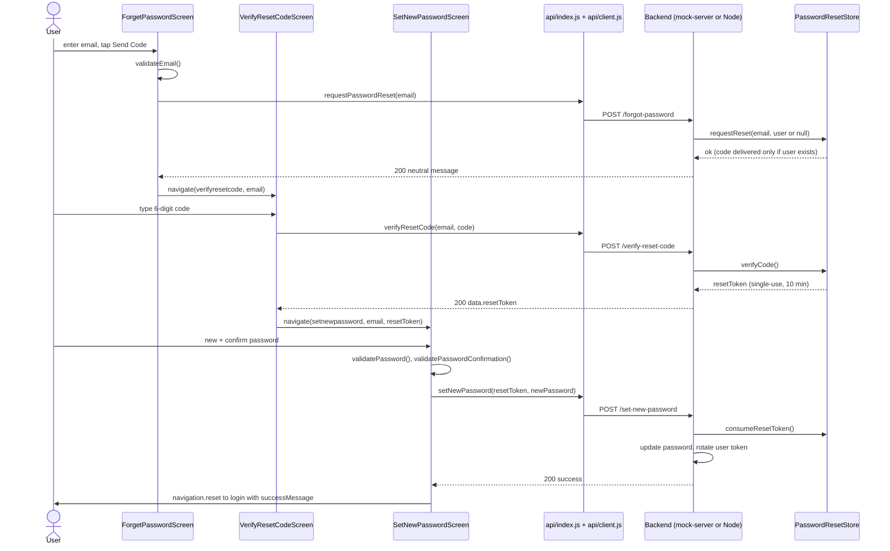
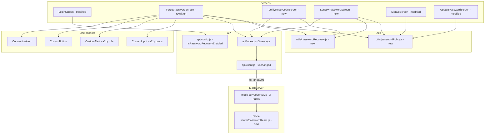
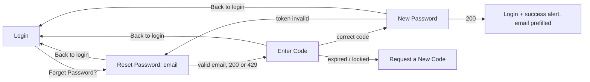
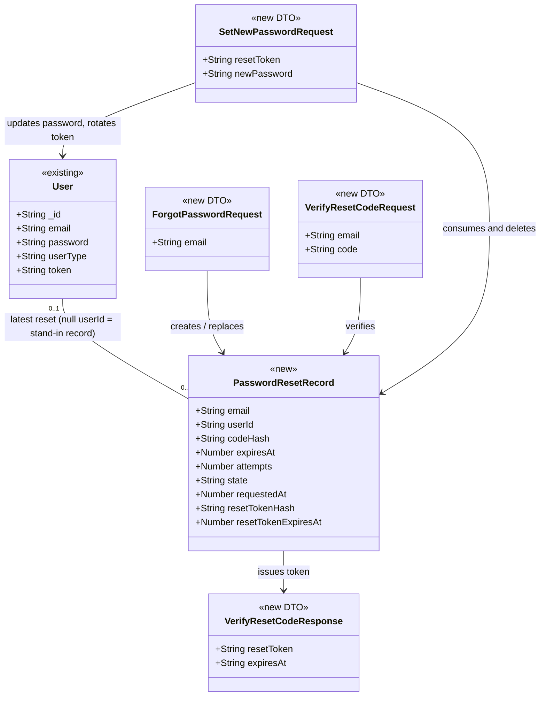

# Design: Secure account recovery (hhamid35/ecommerce-react-native-example#3)

> Linked Jira Epic: [hhamid35/ecommerce-react-native-example#3](https://github.com/hhamid35/ecommerce-react-native-example/issues/3)
> Business spec: v1 (submitted 2026-09-27T11:25:21Z by 142cf940-ee02-4faa-a6b4-2f4e3a1e0f57)
> Architect: ALORA Design Agent (draft for Architect review)

## Architecture overview

### Problem essence and value

A shopper or admin who is signed out proves they control their account email by entering a one-time code that expires quickly. They then choose a new password that meets one shared rule. This replaces the empty `sendInstructionsHandle` TODO in `screens/auth/ForgetPasswordScreen.js`. Locked-out users can recover on their own, and the flow does not let anyone find out who has an account or take over someone else's.

Implicit requirements the Ideation analysis did not state:

- **Verify, then reset (BR-5):** checking the code must return a separate reset token that is short-lived and works once. The set-password step uses that token, so the code is never sent twice and wrong attempts are counted in one place only.
- **Unknown emails behave the same at every step:** an unregistered email must look identical to a registered one on all three endpoints, not only the first. This includes throttling and lockout. Otherwise an attacker could tell accounts apart at step 2.
- **No clash with the expiry redirect:** `api/client.js` adds `x-auth-token` whenever a session exists. It clears the session and redirects to login whenever `err === 'jwt expired'`. The new error codes must never use that string.
- **Signing out other devices (A-4):** in the mock-server this works by rotating the user's `token`. `authMiddleware` looks users up by `token`, so old sessions get `err: 'jwt expired'` and are sent to login by `api/client.js`.
- **Login must not enforce the new, stricter rule:** if it did, existing users with 6 or 7 character passwords (for example the seeded `user123`) would be locked out (A-5).

### Scope and boundaries

- **In scope**:
  - A three-screen recovery flow in the app: request, then verify code, then set new password.
  - Three new named operations in `api/index.js`.
  - A shared email and password validation module, used by sign-up, recovery and Update password.
  - A success message on Login.
  - Accessibility props added to `CustomInput` and `CustomAlert` without changing existing behaviour.
  - A reset-state store and three routes in the mock-server. In development the code is "delivered" by printing it to the console.
  - A written API contract for the production backend team.
  - Jest tests and README updates.
- **Out of scope**:
  - Email links and deep linking. `app.json` has no `scheme` and no linking config exists (A-1).
  - SMS, MFA, admin-initiated resets, and changing an account's email.
  - Real email-provider integration. It belongs to the production backend, which is outside this repository (C-1).
  - Hashing user passwords in the mock-server (C-2).
  - Server-side validation on `/register`.
  - Redesigning Update password, apart from its rules and a one-line check that the server call succeeded.
- **What is reused, extended or replaced**:
  - **Reused unchanged:** the `api/client.js` transport, `CustomButton`, `ConnectionAlert`, `ProgressDialog` (`react-native-progress-dialog`), the top bar and back arrow, and the style blocks from `ForgetPasswordScreen`. The route name `forgetpassword` is kept, so the link in `LoginScreen` still works.
  - **Left as-is:** the existing signed-in `POST /reset-password?id=` route and `api.resetPassword`. The new endpoints use different names, so the current password-change contract stays as it is.
  - **Replaced:** only the body of `ForgetPasswordScreen`. Its placeholder cannot be extended.

### High-level architecture

The app already layers its code as Screen, then named operation (`api/index.js`), then transport (`api/client.js`), then a flat JSON backend contract `{ success, message, data?, err? }`. The mock-server (`mock-server/server.js`) and the production Node backend serve that contract the same way. Recovery adds:

- three public endpoints to that contract;
- three stack screens registered in `routes/Routes.js`;
- two pure utility modules under `utils/`, in the same style as `utils/session.js`, which keeps identity logic in one place.

Recovery state that moves between screens (email and reset token) goes through React Navigation route params. It never goes into Redux, AsyncStorage or SecureStore. In the codebase Redux is used only for the cart, and the Login and Signup screens keep their form state in `useState`.

On the server, reset state lives in memory next to `users`. It sits in a new CommonJS module, `mock-server/passwordReset.js`, which takes the clock and the delivery function as parameters, so it can be unit-tested without starting Express.



### Key design decisions

- **Emailed 6-digit code instead of a link (A-1, business Q-1).** The app has no URL scheme, universal links or web fallback page. A code works the same on iOS, Android and web. We keep the option of links later: a link handler would produce the same `resetToken`, and `SetNewPasswordScreen` would not change.
- **Two phases: verify first, then use a reset token.** `POST /verify-reset-code` swaps a correct code for a random 256-bit `resetToken`. The token expires after 10 minutes and works once. `POST /set-new-password` accepts only that token.
  - Attempt counting stays on the verify step.
  - A weak password does not use up a guess.
  - The code is useless once it has been swapped for a token.
- **Stand-in records for unknown emails.** `requestReset` creates a record even when no user matches, with `userId: null` and a code that is never delivered. Throttling, expiry, lockout and every response are therefore identical for registered and unregistered emails (BR-2, BR-6).
- **Codes and tokens are stored as hashes, even in the mock.** SHA-256 hashes are compared with `crypto.timingSafeEqual`, so the mock shows the security model the production backend must follow. User passwords stay in plain text in the mock (C-2).
- **Rotating the token signs out other devices (A-4).** A successful reset gives the user a new `token`. Old tokens then fail `authMiddleware` with `err: 'jwt expired'`, which triggers the existing central redirect in `api/client.js`. No new client code is needed for this.
- **One validation module for all password rules (A-3, BR-7, AC-11).** `utils/passwordPolicy.js` is used by Signup, SetNewPassword and UpdatePassword. Login keeps only its "field is empty" and email-format checks, and the server decides whether a password is correct. This fixes today's mismatch: Signup checks `< 5` while saying "6 characters", and Login checks `< 6`.
- **Machine-readable `err` codes, turned into text in one place.** Endpoints return `err` codes such as `RESET_CODE_INVALID`. `utils/passwordRecovery.js#messageForRecoveryError` converts them into user-facing messages, so the wording is the same on every screen (BR-11, BR-14).
- **Feature flag `EXPO_PUBLIC_PASSWORD_RECOVERY`.** It is on by default, because the mock supports the whole flow. Setting it to `'false'` hides the "Forget Password?" link, so the app can ship before the production backend is ready (see Rollout).

### Alternatives considered

- **One call with email, code and new password together.** Rejected. It breaks BR-5 (verify before reset). It also mixes attempt counting with password-rule errors, and the user may type a password only to find the code was wrong.
- **Magic link with deep linking.** Rejected for now. It needs `expo-linking` setup, a `scheme` in `app.json`, associated domains or app links, and a web fallback page (a Dependencies item in the business spec). The link can also open on a different device from the one the user is on.
- **Storing recovery state in Redux.** Rejected. Redux here holds only the cart (`states/reducers/cartReducer.js`). The auth screens use `useState` plus route params. A reducer would add boilerplate and keep the reset token around longer than needed.
- **Reusing `POST /reset-password?id=`.** Rejected. That contract needs the user id in the query string plus the current password. Overloading it would mix a signed-in flow with a signed-out one and make it weaker.
- **Returning `attemptsRemaining` to the client.** Rejected. It tells an attacker more than the plain "incorrect code" message does, and the business spec does not require it.

## Affected repositories

- **hhamid35/ecommerce-react-native-example** (branch `main`, type `primary`). Changes here:
  - the app's screens, routes, API operations, utils and two shared components;
  - the mock-server's recovery endpoints and README;
  - new Jest tests, plus `@testing-library/react-native` as a dev dependency (see Q-3).
- **Production backend** (separate repository, not in `repository_targets[]`, per C-1). This spec proposes no code changes there. The API schemas and contracts section, the production data-model guidance and the observability contract below are the hand-off to the backend team.

## Component-level design

### Layered architecture and dependency map



### Extension points

- **Link-based recovery later:** a `verifyResetLink(token)` operation can return the same `{ resetToken }` shape, and `SetNewPasswordScreen` would work unchanged.
- **Tunable limits:** `createPasswordResetStore(options)` takes `codeTtlMs`, `resetTokenTtlMs`, `maxAttempts` and `requestIntervalMs`. Business Q-2 can adjust these without code changes elsewhere. The client-side resend cooldown is the single constant `RESEND_COOLDOWN_SECONDS`.
- **Swapping the delivery method:** `createPasswordResetStore({ deliver })` takes a delivery callback. The mock logs to the console. A real email sender could be plugged in without changing the store.
- **Tightening the password rule later:** `utils/passwordPolicy.js` is the only place the client-side rule lives. Changing business Q-3 means editing one file, plus its mock-server mirror.

### Conventions in use

- **Components**:
  - Screens are functional components with hooks, default-exported, and receive `({ navigation, route })`.
  - Styles use `StyleSheet.create` at the bottom of the file, with colours from `colors` in `../../constants`.
  - Reuse the existing style names: `container`, `TopBarContainer`, `screenNameContainer`, `screenNameText`, `screenNameParagraph`, `formContainer`.
- **Screen state**: one `useState` per field, plus `error` and `alertType` driving a single `CustomAlert`. This is the pattern in `UpdatePasswordScreen`.
- **API calls**:
  - Import with `import * as api from '../../api'`.
  - Operations return the parsed body; callers branch on `result.success`.
  - Network failures reject and are handled in `catch`.
  - Screens never call `fetch` directly.
- **Loading**: `<ProgressDialog visible={isLoading} label={...} />`, as in `LoginScreen`.
- **Offline**: wrap the screen in `<ConnectionAlert onChange={() => {}}>`. On web it simply renders its children.
- **Test IDs**:
  - Use kebab-case `<screen>-<element>`.
  - `CustomInput` adds `-wrapper` to its wrapper; `CustomButton` adds `-text` to its label; `CustomAlert` adds `-container` and `-message`.
  - Keep every existing `forget-password-*` ID.
- **Validation**: early-return guards (`if (msg) return setError(msg)`) before any network call. The logic now comes from `utils/passwordPolicy.js`.
- **Error surface**: the backend sends a machine code in `err` and readable text in `message`. Screens show text from `messageForRecoveryError(result)`. No new custom exception classes; only network failures throw.
- **Logging**:
  - App: new code must not `console.log` responses, emails, codes, tokens or passwords.
  - Mock-server: one-line `console.log` messages prefixed with `[password-reset]`.
- **Comments**: short `//` comments that explain why, in the tone of `api/client.js` and `utils/session.js`.
- **Module format**: the app uses ES modules (`export const`). The mock-server uses CommonJS (`require` / `module.exports`). The mock-server has its own `package.json` and is excluded from ESLint.

### utils/passwordPolicy.js (new)

- **Responsibility**: the one place the app checks email format and the password rule.
- **Collaborators**: none. It is pure JavaScript with no React Native imports, so Jest can test it directly.
- **Exports**:
  - `PASSWORD_MIN_LENGTH = 8`
  - `PASSWORD_MAX_LENGTH = 128`
  - `PASSWORD_RULE_TEXT = 'Password must be at least 8 characters and include a letter and a number'`
  - `normalizeEmail(email: string): string`
    - Returns `String(email || '').trim().toLowerCase()`.
  - `validateEmail(email: string): string | null`
    - Normalise first.
    - Empty: return `'Please enter your email'`.
    - Doesn't match `^[^@ ]+@[^@ ]+[.][^@ ]+$`, or is longer than 254 characters: return `'Please enter a valid email address'`.
    - Otherwise return `null`.
  - `validatePassword(password: string): string | null`
    - Empty: return `'Please enter a password'`.
    - Longer than `PASSWORD_MAX_LENGTH`: return `'Password must be at most 128 characters'`.
    - Shorter than `PASSWORD_MIN_LENGTH`, or fails `/[A-Za-z]/`, or fails `/[0-9]/`: return `PASSWORD_RULE_TEXT`.
    - Otherwise return `null`.
  - `validatePasswordConfirmation(password: string, confirmPassword: string): string | null`
    - Return `'Passwords do not match'` when they differ, otherwise `null`.

### utils/passwordRecovery.js (new)

- **Responsibility**: recovery constants, code-format checks, and turning server `err` codes into user-facing text.
- **Collaborators**: imports `PASSWORD_RULE_TEXT` from `./passwordPolicy`.
- **Exports**:
  - `RESET_CODE_LENGTH = 6`
  - `RESEND_COOLDOWN_SECONDS = 60`
  - `CODE_EXPIRY_MINUTES = 15`, used only in on-screen text.
  - `RECOVERY_MESSAGES`, a frozen object:
    - `requestSent`: `'If an account exists for this email, we have sent a 6-digit code. It expires in 15 minutes.'`
    - `throttled`: `'A code was sent recently. Check your inbox and spam folder, or wait a minute before requesting another.'`
    - `codeFormat`: `'Enter the 6-digit code from your email'`
    - `codeInvalid`: `'That code is incorrect. Check the code and try again.'`
    - `codeExpired`: `'This code has expired or has already been used. Request a new code.'`
    - `attemptsExceeded`: `'Too many incorrect attempts. Request a new code.'`
    - `tokenInvalid`: `'Your reset session has expired. Request a new code to continue.'`
    - `success`: `'Your password has been reset. Log in with your new password.'`
    - `network`: `'We could not reach the server. Check your connection and try again.'`
    - `server`: `'Something went wrong on our side. Please try again.'`
  - `validateResetCode(code: string): string | null`
    - Trim, then test `/^[0-9]{6}$/`. On failure return `RECOVERY_MESSAGES.codeFormat`.
  - `messageForRecoveryError(result: object | undefined): string`
    - Switch on `result?.err`:
      - `RESET_THROTTLED`: `throttled`
      - `RESET_CODE_INVALID`: `codeInvalid`
      - `RESET_CODE_EXPIRED`: `codeExpired`
      - `RESET_ATTEMPTS_EXCEEDED`: `attemptsExceeded`
      - `RESET_TOKEN_INVALID`: `tokenInvalid`
      - `PASSWORD_POLICY`: `result.message || PASSWORD_RULE_TEXT`
      - `INVALID_EMAIL`: `'Please enter a valid email address'`
      - anything else: `result?.message || RECOVERY_MESSAGES.server`
  - `isRestartRequired(err: string | undefined): boolean`
    - `true` for `RESET_CODE_EXPIRED`, `RESET_ATTEMPTS_EXCEEDED` and `RESET_TOKEN_INVALID`.

### api/index.js (modified)

- **Responsibility**: add the recovery operations to the backend layer.
- **Changes** (under `// ---- Auth / users ----`, after `resetPassword`):
  - `export const requestPasswordReset = (email) => post('/forgot-password', { email });`
  - `export const verifyResetCode = (email, code) => post('/verify-reset-code', { email, code });`
  - `export const setNewPassword = (resetToken, newPassword) => post('/set-new-password', { resetToken, newPassword });`
  - Change the final re-export to `export { getBaseUrl, imageUrl, isPasswordRecoveryEnabled } from './config';`
- **Behaviour**: unchanged transport. JSON bodies, the parsed body is returned, and network errors reject.

### api/config.js (modified)

- Add `export function isPasswordRecoveryEnabled(): boolean`.
  - Return `process.env.EXPO_PUBLIC_PASSWORD_RECOVERY !== 'false'`, protected by the same `typeof process !== 'undefined' && process.env` check that `getBaseUrl` uses.
  - Use the literal property access `process.env.EXPO_PUBLIC_PASSWORD_RECOVERY`. Expo only inlines `EXPO_PUBLIC_*` variables when they are accessed statically.

### screens/auth/ForgetPasswordScreen.js (rewritten; route `forgetpassword`)

- **Responsibility**: collect and check the email, request a code, and go to the verify step.
- **Collaborators**: `api.requestPasswordReset`, `validateEmail`, `normalizeEmail`, `messageForRecoveryError`, `RECOVERY_MESSAGES`, `CustomInput`, `CustomButton`, `CustomAlert`, `ConnectionAlert`, `ProgressDialog`.
- **Props**: `({ navigation, route })`.
- **State**:
  - `email`, starting from `route?.params?.email ?? ''`
  - `error` (`''`), `alertType` (`'error'`), `isLoading` (`false`)
- **`const sendInstructionsHandle = async () => {...}`**, moved inside the component:
  1. Run `validateEmail(email)`. If it returns a message, set the error alert and return. No request is sent (AC-2).
  2. Normalise the email, set `isLoading` to `true`, and clear `error`.
  3. `const result = await api.requestPasswordReset(normalized)` inside `try`.
  4. If `result.success`, call `navigation.navigate('verifyresetcode', { email: normalized, notice: RECOVERY_MESSAGES.requestSent })` (AC-3).
  5. Else if `result.err === 'RESET_THROTTLED'`, navigate the same way with `notice: RECOVERY_MESSAGES.throttled`. The throttle applies to every email, so this reveals nothing.
  6. Otherwise show `messageForRecoveryError(result)`.
  7. On `catch`, show `RECOVERY_MESSAGES.network`. In `finally`, set `isLoading` to `false`. `email` is never cleared (AC-10).
- **Render**: see UI/UX notes. Existing test IDs are kept, and new ones are `forget-password-alert` and `forget-password-login-link`.

### screens/auth/VerifyResetCodeScreen.js (new; route `verifyresetcode`)

- **Responsibility**: take the 6-digit code, swap it for a reset token, and support resending with a cooldown.
- **Collaborators**: `api.verifyResetCode`, `api.requestPasswordReset`, `validateResetCode`, `messageForRecoveryError`, `isRestartRequired`, `RECOVERY_MESSAGES`, `RESEND_COOLDOWN_SECONDS`, `RESET_CODE_LENGTH`, plus the shared components.
- **Route params**: `{ email: string, notice?: string }`.
- **State**:
  - `code` (`''`)
  - `error`, starting from `route.params?.notice ?? ''`
  - `alertType`: `'success'` if there is a notice, otherwise `'error'`
  - `isLoading` (`false`), `cooldown` (starts at `RESEND_COOLDOWN_SECONDS`), `restartRequired` (`false`)
- **Effect**: while `cooldown > 0`, a `setInterval` lowers it by 1 every second. The effect cleans up on unmount and whenever `cooldown` reaches 0.
- **`verifyHandle = async () => {...}`**:
  1. Run `validateResetCode(code)`. If it fails, show an error and return.
  2. Set `isLoading` and call `api.verifyResetCode(email, code.trim())`.
  3. On success with `result.data?.resetToken`, clear `code` and call `navigation.navigate('setnewpassword', { email, resetToken: result.data.resetToken })`.
  4. Otherwise show `messageForRecoveryError(result)` and set `restartRequired` to `isRestartRequired(result.err)` (AC-5, AC-6).
  5. On `catch`, show `RECOVERY_MESSAGES.network` and keep `code`.
- **`resendHandle = async () => {...}`**:
  1. If `cooldown > 0` or `isLoading`, return.
  2. Call `api.requestPasswordReset(email)`.
  3. On success: show a `requestSent` success alert, clear `code`, set `restartRequired` to `false`, and reset `cooldown` to `RESEND_COOLDOWN_SECONDS` (BR-12).
  4. On `RESET_THROTTLED`: show a `throttled` error and set `cooldown` to `result.retryAfterSeconds ?? RESEND_COOLDOWN_SECONDS`.
  5. On any other failure, show the mapped message. On `catch`, show the network message.
- **Missing email**: if `route.params?.email` is empty, for example after a web refresh, show `tokenInvalid` and only the "Request a new code" action, which goes to `forgetpassword`.

### screens/auth/SetNewPasswordScreen.js (new; route `setnewpassword`)

- **Responsibility**: collect and check the new password, send it with the reset token, and return the user to login.
- **Collaborators**: `api.setNewPassword`, `validatePassword`, `validatePasswordConfirmation`, `PASSWORD_RULE_TEXT`, `messageForRecoveryError`, `isRestartRequired`, `RECOVERY_MESSAGES`, plus the shared components.
- **Route params**: `{ email: string, resetToken: string }`.
- **State**: `newPassword`, `confirmPassword`, `error`, `isLoading`, and `restartRequired`. `restartRequired` starts as `!route.params?.resetToken`.
- **`submitHandle = async () => {...}`**:
  1. Show the first message returned by `validatePassword(newPassword)`, then by `validatePasswordConfirmation(newPassword, confirmPassword)`, and return. No request is sent (AC-7).
  2. Call `api.setNewPassword(route.params.resetToken, newPassword)`.
  3. On success: `navigation.reset({ index: 0, routes: [{ name: 'login', params: { successMessage: RECOVERY_MESSAGES.success, email: route.params.email } }] })` (AC-9). This removes the recovery screens from history, so Back cannot return to a used token.
  4. On failure: show the mapped message and set `restartRequired` to `isRestartRequired(result.err)`. A `PASSWORD_POLICY` failure keeps the token usable.
  5. On `catch`: show the network message and keep both inputs (AC-10).
- **Restart action**: while `restartRequired` is true, the main button becomes "Request a New Code" and calls `navigation.navigate('forgetpassword', { email: route.params?.email })`.

### screens/auth/LoginScreen.js (modified)

- Accept `route`.
- Start `email` from `route?.params?.email ?? ''`.
- Add `const [notice, setNotice] = useState(route?.params?.successMessage ?? '')`.
- Render `<CustomAlert message={notice} type={'success'} testID='login-success-alert' />` just before the existing error alert.
- Call `setNotice('')` at the start of `loginHandle`.
- Remove the `password.length < 6` guard, whose message was wrong. Login keeps its empty-field and email checks, and the server decides whether the credentials are valid (A-5).
- Wrap the "Forget Password?" `Text` in `{api.isPasswordRecoveryEnabled() && (...)}`.

### screens/auth/SignupScreen.js (modified)

- Replace the email checks (`== ''`, `includes('@')`, `length < 6`) with `validateEmail(email)`.
- Replace the password check (`== ''`, `length < 5` with its "6 characters" message) with `validatePassword(password)`.
- Replace the "password does not match" check with `validatePasswordConfirmation(password, confirmPassword)`.
- Keep the name check. Checks run in this order: email, name, password, confirmation.
- Add a hint under the password input: `<Text testID='signup-password-rule'>{PASSWORD_RULE_TEXT}</Text>`.

### screens/profile/UpdatePasswordScreen.js (modified)

- After the existing "same as current password" check, add `validatePassword(newPassword)`.
- Replace the "Password not matched" check with `validatePasswordConfirmation(newPassword, confirmPassword)`.
- In `.then`, show success only when `result.success`. Otherwise set `alertType` to `'error'` and show `result.message`. Today every response shows as success, which would hide rule rejections.
- Add `{PASSWORD_RULE_TEXT}` as a second line in the instruction paragraph, with testID `update-password-rule`.

### components/CustomInput/CustomInput.js (modified)

- Add optional props `accessibilityLabel`, `autoCapitalize`, `autoComplete` and `textContentType`, passed straight to `TextInput`.
- If a prop is not given, React Native's default applies, so existing screens are unaffected.

### components/CustomAlert/CustomAlert.js (modified)

- On the message container `View`, add `accessibilityRole='alert'` and `accessibilityLiveRegion='polite'`. Screen readers will then announce messages (BR-15).
- No prop changes.

### routes/Routes.js (modified)

- Import `VerifyResetCodeScreen` and `SetNewPasswordScreen` from `../screens/auth/`.
- Register `<Stack.Screen name='verifyresetcode' component={VerifyResetCodeScreen} />` and `<Stack.Screen name='setnewpassword' component={SetNewPasswordScreen} />` right after `forgetpassword`.

### mock-server/passwordReset.js (new, CommonJS)

- **Responsibility**: in-memory reset state that expires on time, works once, and throttles requests, with a clock you can replace in tests.
- **Collaborators**: Node `crypto` only.
- **Exports**: `createPasswordResetStore`, `normalizeEmail`, `validatePasswordPolicy` and `isValidEmail`.
  - `validatePasswordPolicy` must match `utils/passwordPolicy.js#validatePassword` exactly. Add a comment in both files pointing to the other.
  - `isValidEmail` uses the same pattern as the app.
- **Signature**: `createPasswordResetStore({ now = () => Date.now(), codeTtlMs = 900000, resetTokenTtlMs = 600000, maxAttempts = 5, requestIntervalMs = 60000, deliver = () => {} } = {})` returns `{ requestReset, verifyCode, consumeResetToken, size }`.
- **Internals**:
  - `records` is a `Map` keyed by normalised email.
  - `hash(v)` is `crypto.createHash('sha256').update(v).digest('hex')`.
  - `safeEqual(a, b)` compares hex strings of equal length with `crypto.timingSafeEqual(Buffer.from(a,'hex'), Buffer.from(b,'hex'))`.
- **`requestReset(email, user)`**, returning `{ ok: true } | { ok: false, err: 'RESET_THROTTLED', retryAfterSeconds }`:
  1. Normalise the email to get the key.
  2. If a record exists and `now() - requestedAt < requestIntervalMs`, return throttled with `Math.ceil(remainingMs / 1000)`.
  3. Create a code: `String(crypto.randomInt(0, 1000000)).padStart(6, '0')`.
  4. Replace the record, so the newest request wins (BR-4), with `{ email: key, userId: user ? user._id : null, codeHash, expiresAt: now() + codeTtlMs, attempts: 0, state: 'PENDING', requestedAt: now(), resetTokenHash: null, resetTokenExpiresAt: null }`.
  5. Only when `user` exists, call `deliver(key, code, expiresAt)`.
- **`verifyCode(email, code)`**, returning `{ ok: true, resetToken, expiresAt } | { ok: false, err }`:
  1. No record: `RESET_CODE_INVALID`.
  2. `state === 'LOCKED'`: `RESET_ATTEMPTS_EXCEEDED`.
  3. `state === 'VERIFIED'`, meaning the code was already swapped for a token: `RESET_CODE_EXPIRED`.
  4. `now() > expiresAt`: `RESET_CODE_EXPIRED`.
  5. A match requires `record.userId !== null` and `safeEqual(hash(code), codeHash)`. Stand-in records never match.
  6. No match: increase `attempts`. At `attempts >= maxAttempts`, set `state = 'LOCKED'` and return `RESET_ATTEMPTS_EXCEEDED`. Otherwise return `RESET_CODE_INVALID`.
  7. Match: `resetToken = crypto.randomBytes(32).toString('hex')`. Set `state = 'VERIFIED'`, `resetTokenHash = hash(resetToken)` and `resetTokenExpiresAt = now() + resetTokenTtlMs`, then return the token.
- **`consumeResetToken(resetToken)`**, returning `{ ok: true, userId } | { ok: false, err: 'RESET_TOKEN_INVALID' }`:
  - Find the record with `state === 'VERIFIED'` whose `resetTokenHash` equals `hash(resetToken)`, using `safeEqual`.
  - If none is found, or `now() > resetTokenExpiresAt`, return invalid.
  - Otherwise `records.delete(key)`, so the token works once, and return the `userId`.
- **`size()`**: returns `records.size`. Tests only.
- **Concurrency**: Node runs one thread, and each method is synchronous, so check-then-set cannot race.

### mock-server/server.js (modified)

- Require `./passwordReset`.
- Create `const passwordResets = createPasswordResetStore({ deliver: (email, code, expiresAt) => console.log(...) })`, logging the dev-only line described under Observability.
- Add the three routes described under API schemas and contracts, placed after `POST /reset-password`.
- Look users up with `users.find((u) => normalizeEmail(u.email) === email)`.
- On successful `/set-new-password`: set `user.password = newPassword` and `user.token = 'mock-token-' + uuidv4()`, which signs out other sessions.
- Add the three endpoints to the list printed at startup.

### mock-server/README.md (modified)

- Add the three rows to the Endpoints table.
- Add a section "Password recovery (dev)" explaining:
  - the code is printed to the server console, and no email is sent;
  - the limits: 15 minutes, 5 attempts, 1 request per minute;
  - all state is lost when the server restarts.
- Correct the stated port to 3002, matching `PORT` in `server.js`.

## UI/UX design notes

**Flow** (all three screens use the existing auth-screen layout: back arrow in `TopBarContainer`, a 30px bold muted heading, a 15px paragraph, then the form):



**Screen copy and elements**

| Screen | Heading | Paragraph | Inputs | Primary button | Secondary links |
| --- | --- | --- | --- | --- | --- |
| `forgetpassword` | Reset Password | Enter the email associated with your account and we'll send you a 6-digit code to reset your password. | Email (`keyboardType='email-address'`, `autoCapitalize='none'`, `textContentType='emailAddress'`, label "Email address") | Send Code | Back to login |
| `verifyresetcode` | Enter Code | We sent a 6-digit code to {email} if an account exists. It expires in 15 minutes. Check your spam folder if you don't see it. | Code (`keyboardType='number-pad'`, `maxLength={6}`, `textContentType='oneTimeCode'`, label "6-digit reset code") | Verify Code (or "Request a New Code" when a restart is required) | Resend code / Resend code in {n}s; Use a different email; Back to login |
| `setnewpassword` | New Password | {PASSWORD_RULE_TEXT} | New Password, Confirm New Password (`secureTextEntry`, `textContentType='newPassword'`) | Reset Password (or "Request a New Code") | Back to login |
| `login` | (unchanged) | (unchanged) | Email prefilled after a reset | (unchanged) | Success alert `login-success-alert` |

**States and interactions**

- **Loading**: a modal `ProgressDialog` with the labels "Sending ...", "Verifying ..." or "Saving ...". It blocks double taps.
- **Messages**: one `CustomAlert` per screen, green for notices and red for errors. The text comes from `RECOVERY_MESSAGES`.
- **Resend cooldown**: "Resend code in 42s" is shown as greyed text that cannot be tapped. At 0 it becomes a tappable link in `colors.primary`, styled like `signupText` on Login.
- **Restart required** (expired, locked or token invalid): the primary button changes label and action. The code field is hidden on Verify.
- **Offline**: on native, `ConnectionAlert` shows its banner. Any failed `fetch` shows `RECOVERY_MESSAGES.network`, and inputs are kept.
- **Back arrow**: `navigation.goBack()`.
- **"Back to login" link**: `navigation.navigate('login')`, which returns to the Login screen already in the stack.
- **Accessibility**:
  - Every input has an `accessibilityLabel`.
  - Alerts are announced through `accessibilityRole='alert'`.
  - Tappable `Text` links get `accessibilityRole='link'`.
  - Every element has a `testID`.

**Test IDs**

- `forget-password-screen`, `forget-password-back-btn`, `forget-password-heading`, `forget-password-instruction`, `forget-password-alert`, `forget-password-email-input`, `forget-password-submit-btn`, `forget-password-login-link`
- `verify-code-screen`, `verify-code-back-btn`, `verify-code-heading`, `verify-code-instruction`, `verify-code-alert`, `verify-code-input`, `verify-code-submit-btn`, `verify-code-restart-btn`, `verify-code-resend-link`, `verify-code-change-email-link`, `verify-code-login-link`
- `set-password-screen`, `set-password-back-btn`, `set-password-heading`, `set-password-rule`, `set-password-alert`, `set-password-new-input`, `set-password-confirm-input`, `set-password-submit-btn`, `set-password-restart-btn`, `set-password-login-link`
- `login-success-alert`, `signup-password-rule`, `update-password-rule`

**Across platforms (BR-14)**: the same components and wording on iOS, Android and web. `textContentType='oneTimeCode'` turns on iOS autofill of the code; on other platforms it does nothing. React Navigation has no `linking` config, so web URLs carry no route params and the reset token never appears in the address bar.

## API schemas and contracts

All three endpoints are **public**: no `x-auth-token` is required, and any token `api/client.js` attaches is ignored. They accept and return JSON with `Content-Type: application/json`, and use the existing flat shape `{ success: boolean, message: string, err?: string, data?: object }`. The production backend must follow this contract exactly (C-1). Never return `err: 'jwt expired'` from these endpoints.

```http
POST /forgot-password
Body: { "email": "string (required, <= 254 chars)" }

200 OK  (registered AND unregistered emails, identical body)
{ "success": true, "message": "If an account exists for this email, we have sent a 6-digit code." }

400 Bad Request  (missing or malformed email)
{ "success": false, "err": "INVALID_EMAIL", "message": "Please enter a valid email address" }

429 Too Many Requests  (a request for this normalised email within the last 60 s; applies to unregistered emails too)
{ "success": false, "err": "RESET_THROTTLED", "message": "A code was sent recently. Please wait before requesting another.", "retryAfterSeconds": 37 }
```

What the server does: normalise the email (trim, lowercase). Create or replace the reset record, where the newest request wins. Generate a 6-digit code with a secure random generator. Store only its hash, with a 15-minute expiry and 5 allowed attempts. Email the code only when the account exists.

```http
POST /verify-reset-code
Body: { "email": "string (required)", "code": "string, exactly 6 digits (required)" }

200 OK
{ "success": true, "message": "Code verified", "data": { "resetToken": "64-char hex string", "expiresAt": "ISO-8601 timestamp (now + 10 min)" } }

400 Bad Request
{ "success": false, "err": "RESET_CODE_INVALID", "message": "The code is incorrect" }
{ "success": false, "err": "RESET_CODE_EXPIRED", "message": "The code has expired or has already been used" }

429 Too Many Requests  (5th wrong attempt and every attempt after it, until a new code is requested)
{ "success": false, "err": "RESET_ATTEMPTS_EXCEEDED", "message": "Too many incorrect attempts" }
```

What the server does:

- A malformed code, or no record for the email, returns `RESET_CODE_INVALID` and does not count as an attempt.
- A wrong code counts as one attempt.
- A correct code is marked used and swapped for a single-use `resetToken`. Only the token's hash is stored.
- Unregistered emails, which have stand-in records, never verify, and they lock after 5 attempts exactly like real ones.

```http
POST /set-new-password
Body: { "resetToken": "string (required)", "newPassword": "string (required)" }

200 OK
{ "success": true, "message": "Password reset successfully" }

400 Bad Request
{ "success": false, "err": "PASSWORD_POLICY", "message": "Password must be at least 8 characters and include a letter and a number" }
{ "success": false, "err": "RESET_TOKEN_INVALID", "message": "Reset session is invalid or has expired" }
```

What the server does, in order:

1. A missing token returns `RESET_TOKEN_INVALID`.
2. The password is checked against the rule before the token is used up. A weak password returns `PASSWORD_POLICY`, and the token stays valid.
3. The token is used up. If it is invalid, expired or already used, return `RESET_TOKEN_INVALID`.
4. The password is updated (hashed in production).
5. Every existing session is invalidated: the mock rotates `user.token`, and production bumps a token version.
6. The user is not signed in automatically.

**Error code catalogue**

| `err` | HTTP | Endpoint(s) | Client message key | Restart required |
| --- | --- | --- | --- | --- |
| `INVALID_EMAIL` | 400 | forgot-password | (inline email message) | no |
| `RESET_THROTTLED` | 429 | forgot-password | `throttled` | no |
| `RESET_CODE_INVALID` | 400 | verify-reset-code | `codeInvalid` | no |
| `RESET_CODE_EXPIRED` | 400 | verify-reset-code | `codeExpired` | yes |
| `RESET_ATTEMPTS_EXCEEDED` | 429 | verify-reset-code | `attemptsExceeded` | yes |
| `PASSWORD_POLICY` | 400 | set-new-password | server `message` | no |
| `RESET_TOKEN_INVALID` | 400 | set-new-password | `tokenInvalid` | yes |
| (fetch rejects) | n/a | any | `network` | no |
| (other / 5xx) | 5xx | any | `server` | no |

**Client operations** (`api/index.js`):

- `requestPasswordReset(email: string): Promise<Result>`
- `verifyResetCode(email: string, code: string): Promise<Result<{ resetToken: string, expiresAt: string }>>`
- `setNewPassword(resetToken: string, newPassword: string): Promise<Result>`

`Result` is the parsed body described above. The promise rejects only on network failure.

## Integration patterns

- **Inbound (app to backend)**:
  - Requests are synchronous HTTP through the existing `api/client.js`.
  - `getBaseUrl()` already handles `EXPO_PUBLIC_API_URL` and the Android `10.0.2.2` rewrite, so recovery works against the mock-server (`:3002`) or the Node backend (`:3000`) without code changes.
  - No new transport, headers or interceptors.
- **Outbound (backend to user)**:
  - **Mock**: the `deliver` callback prints the code to the server console (BR-13).
  - **Production**: the backend team sends a transactional email through the chosen provider, from a verified sender domain.
    - Subject: "Your EasyBuy password reset code".
    - Body: the 6-digit code, "expires in 15 minutes", "If you didn't request this, you can ignore this email; your password has not changed", and a support contact.
    - No link and no user-specific data beyond the code.
    - The email should be sent asynchronously, so a slow provider neither delays the neutral 200 nor exposes whether the account exists through timing.
- **Repeat requests and retries**:
  - `POST /forgot-password` is throttled to one request per 60 s per email, and the newest request cancels earlier codes. It is not idempotent by design, since each accepted call issues a new code.
  - `POST /verify-reset-code` is not idempotent: each wrong call counts as an attempt.
  - `POST /set-new-password` works once per `resetToken`.
  - The client never retries automatically. The user retries, with inputs kept. `ProgressDialog` blocks double submission.
  - The resend cooldown on the client mirrors the server throttle, and uses `retryAfterSeconds` from the server when given.
- **Session invalidation**: after a successful reset, other devices hold stale tokens. Their next authenticated call returns `err: 'jwt expired'`, and the existing handler in `api/client.js` clears the session and calls `resetToLogin()`.

## Data model changes

### Entity relationships



`state` moves through these values: `PENDING` becomes `VERIFIED` (correct code) or `LOCKED` (5 wrong attempts). A record is removed when its token is used, or replaced by the next request.

### Schema changes

- **Mock-server (this repository)**: a new in-memory `Map<string, PasswordResetRecord>` inside `createPasswordResetStore`, keyed by normalised email. There is no database. The `users` array keeps its shape, and only the values of `token` and `password` change on reset. State is lost on restart, as documented in the README.
- **App**: no storage changes. The reset token exists only in React Navigation params and component state. It is never written to AsyncStorage or SecureStore, and `navigation.reset` drops it on success.
- **Production backend (hand-off guidance, outside this repository)**:
  - Table `password_reset_requests`:
    - `id uuid pk`
    - `email_normalized varchar(254) not null unique`: one active row per email, where the newest request wins
    - `user_id` nullable, with a foreign key to users
    - `code_hash char(64) not null`: HMAC-SHA256 using a server secret
    - `expires_at timestamptz not null`
    - `attempts smallint not null default 0`
    - `state varchar(16) not null`
    - `requested_at timestamptz not null`
    - `reset_token_hash char(64) null`, with an index
    - `reset_token_expires_at timestamptz null`
    - `created_at timestamptz default now()`
  - On users: add `token_version integer not null default 0` (or `password_changed_at timestamptz`), included in the JWT and checked by auth middleware so that a reset invalidates sessions. Nothing needs backfilling, because the default of 0 works for every existing user.
  - Remove expired rows every hour.

### Backward-compatibility plan

- The change only adds things. Endpoints, props and routes are new, and existing contracts (`/login`, `/register`, `/reset-password?id=`) are unchanged.
- `CustomInput` and `CustomAlert` gain only optional props or attributes, and every existing caller behaves the same.
- Existing passwords that don't meet the new rule still work at login (A-5). The rule applies only when a password is next set, at sign-up, recovery or update.
- An older app build keeps its dead Forgot screen and never calls the new endpoints, so deploying the backend first is safe. The Rollout step "Backend first" covers this order.

## Security and compliance considerations

- **Auth**:
  - The three endpoints are public on purpose. Their protection comes from possessing the code, expiry, single use and rate limits.
  - The reset token is a 256-bit random bearer credential that lasts 10 minutes and works once.
  - Admin accounts get exactly the same controls, with no shortcuts (A-6).
- **Account enumeration (BR-2)**:
  - All three endpoints give identical status, body and throttle or lockout behaviour for registered and unregistered emails, thanks to the stand-in records.
  - The production backend must also keep response times the same, by sending email off the request path.
- **Brute force (BR-6)**:
  - There are 10^6 possible codes and 5 attempts per code, so a single code has about a 5 in 10^6 chance of being guessed.
  - The one-request-per-minute throttle limits guessing per email. Production must also cap at 10 reset requests per email per 24 h, and add a per-IP limit (for example 30 requests per IP per hour across the three endpoints), to limit guessing that is spread over time.
  - The security review signs off on these numbers (business Q-2).
- **Secret handling**:
  - Codes and reset tokens are stored only as hashes: SHA-256 in the mock, HMAC-SHA256 with a server-side secret in production.
  - Comparisons are constant-time.
  - New passwords are never echoed back, logged or stored on the device (BR-8). Production stores them with the backend's existing password hashing (bcrypt or argon2).
  - Production needs one new secret, `PASSWORD_RESET_HMAC_SECRET`, plus the email-provider API key. Both go in the backend's secret store, never in the app or `eas.json`.
  - The app gains no new secrets.
- **Transport**: production `EXPO_PUBLIC_API_URL` must be `https://`. The code and token travel only in POST bodies, never in query strings, because query strings end up in access logs.
- **Sessions (BR-9)**: every existing session is invalidated when the reset completes, and there is no automatic sign-in.
- **PII and data classification**:
  - The email address is PII. The app never logs it.
  - In development, the mock logs the email and code together. This is acceptable only for local use and is documented in the README.
  - Production logs must record a user ID or a hash of the email, not the raw address.
- **Audit log entries** (production backend): record each of `password_reset.requested`, `password_reset.throttled`, `password_reset.code_failed`, `password_reset.locked`, `password_reset.verified` and `password_reset.completed`. Each entry carries `{ timestamp, userId or null, emailHash, ipHash, userAgent, outcome }`, and never the code, token or password. `completed` must also trigger a notification email: "Your EasyBuy password was changed".
- **Regulatory and standards**: follow OWASP ASVS V2.5 (credential recovery) and the OWASP Forgot Password Cheat Sheet. Collecting only what is needed, in line with GDPR, is covered by the no-raw-email logging rule. The security review is a release gate.
- **Existing adjacent weakness**: `POST /reset-password?id=` in the mock accepts a user ID with no authentication. It is out of scope and not changed here, but it is flagged for the production backend review (business risk "Existing password-change weakness").

## Observability requirements

- **Structured logs, app**: no telemetry SDK exists in this repository, and this design adds none. New screens must not `console.log` request or response bodies, emails, codes, tokens or passwords. Unexpected errors in a `catch` may call `console.warn('[password-reset] network error', err?.message)` without any user data.
- **Structured logs, mock-server** (exact formats):
  - Accepted request, one line: `[password-reset] requested email=<normalised> registered=<true|false>`
  - Delivery, dev only: `[password-reset] DEV CODE email=<normalised> code=<6 digits> expiresAt=<ISO> (no email sent)`
  - Throttled: `[password-reset] throttled email=<normalised> retryAfterSeconds=<n>`
  - Verification: `[password-reset] verify email=<normalised> outcome=<success|invalid|expired|locked>`
  - Completion: `[password-reset] completed userId=<id> sessionsRevoked=true`, or on failure `[password-reset] set-password outcome=<token_invalid|policy>`
- **Metrics** (production backend contract):
  - `password_reset_requests_total{outcome=accepted|throttled|invalid_email}`
  - `password_reset_verifications_total{outcome=success|invalid|expired|locked}`
  - `password_reset_completions_total{outcome=success|token_invalid|policy}`
  - `password_reset_email_send_duration_seconds` (histogram)
  - `password_reset_email_failures_total{provider_error}`
- **Traces** (production backend): one server span per endpoint, named `password_reset.request`, `password_reset.verify` and `password_reset.complete`. Attributes: `outcome` and `user.id` when known, never the email, code or token. The email send is a child span.
- **Dashboards and alerts**:
  - Dashboard: a funnel of requests accepted, then verifications succeeded, then completions succeeded.
  - Alert when email failures exceed 2% of sends over 15 minutes.
  - Alert when `locked` exceeds 5 times its 7-day baseline in an hour, which may mean an attack.
  - Alert when completions/accepted falls below 30% over 24 h, which suggests delivery or spam-folder problems.
  - Track support tickets tagged "password" before and after release (business spec, Release step).

## Implementation plan

> This section is the prompt for the Code Generation Agent. Follow the phases in order. After each phase run `npm test`, and `npm run lint` for app code.

### Phase 1 — Shared validation utilities

1. **Create `utils/passwordPolicy.js`** with `PASSWORD_MIN_LENGTH`, `PASSWORD_MAX_LENGTH`, `PASSWORD_RULE_TEXT`, `normalizeEmail`, `validateEmail`, `validatePassword` and `validatePasswordConfirmation`, exactly as specified in Component-level design.
   - Verify with `__tests__/passwordPolicy.test.js`: empty, malformed or overlong email; valid email with mixed case and spaces; passwords that are empty, 7 characters, letters only, digits only, 129 characters, and valid `abcdefg1`; matching and mismatched confirmation.
2. **Create `utils/passwordRecovery.js`** with `RESET_CODE_LENGTH`, `RESEND_COOLDOWN_SECONDS`, `CODE_EXPIRY_MINUTES`, `RECOVERY_MESSAGES` (made read-only with `Object.freeze`), `validateResetCode`, `messageForRecoveryError` and `isRestartRequired`.
   - Verify with `__tests__/passwordRecovery.test.js`: every `err` in the catalogue maps to its message; unknown `err` falls back to `result.message` and then `server`; `isRestartRequired` is true only for the three restart codes; `validateResetCode` accepts `'012345'` and rejects `'12345'`, `'1234567'` and `'12a456'`.

### Phase 2 — Mock-server recovery backend

1. **Create `mock-server/passwordReset.js`** (CommonJS) with `createPasswordResetStore`, `normalizeEmail`, `isValidEmail` and `validatePasswordPolicy`, as specified.
   - Verify with `__tests__/mockServerPasswordReset.test.js`, which requires `../mock-server/passwordReset` and uses an injected `now` plus a `deliver` jest mock that captures the code. Cover:
     - the happy path, where verify returns a 64-hex token and consume returns the userId;
     - a wrong code, then locking on the 5th wrong attempt, then even the correct code rejected;
     - expiry at 15 min + 1 ms;
     - throttle within 60 s, with `retryAfterSeconds`;
     - the newest request replacing the previous code;
     - a code already swapped for a token returning `RESET_CODE_EXPIRED`;
     - a token working once and expiring at 10 min;
     - an unregistered email: `deliver` not called, verify always invalid, lock after 5, throttle identical;
     - `validatePasswordPolicy` agreeing with `utils/passwordPolicy.validatePassword` on a shared table of cases.
2. **Wire the routes in `mock-server/server.js`**: `POST /forgot-password`, `POST /verify-reset-code` and `POST /set-new-password`, with the status codes and bodies from API schemas and contracts, the `[password-reset]` log lines, and token rotation on success. Add them to the startup list.
   - Verify manually: `cd mock-server && npm start`, then with curl request a code, read it from the console, verify it, set a new password, and log in with the new password (200). The old password and the old `mock-user-token-001` on `GET /orders` should both get 401.
3. **Update `mock-server/README.md`** with the endpoint rows, the dev recovery section, and the port correction to 3002.

### Phase 3 — API layer

1. **`api/index.js`**: add `requestPasswordReset`, `verifyResetCode` and `setNewPassword`, and re-export `isPasswordRecoveryEnabled`.
2. **`api/config.js`**: add `isPasswordRecoveryEnabled()`.
   - Verify with `__tests__/apiPasswordRecovery.test.js`:
     - `jest.mock('../utils/session', () => ({ getToken: jest.fn().mockResolvedValue(null), clearSession: jest.fn() }))` and `jest.mock('../routes/navigationRef', () => ({ resetToLogin: jest.fn() }))`.
     - Stub `global.fetch`, then check that each operation calls `http://localhost:3002/<path>` with `method: 'POST'` and the right JSON body.
     - Check that the flag returns `false` only when the env var is `'false'`.

### Phase 4 — Shared components

1. **`components/CustomInput/CustomInput.js`**: pass `accessibilityLabel`, `autoCapitalize`, `autoComplete` and `textContentType` through to `TextInput`.
2. **`components/CustomAlert/CustomAlert.js`**: add `accessibilityRole='alert'` and `accessibilityLiveRegion='polite'` to the message container.
   - Verify that existing screens render unchanged (smoke test in Phase 6) and that lint passes.

### Phase 5 — Recovery screens and routes

1. **Rewrite `screens/auth/ForgetPasswordScreen.js`** as specified. Keep its styles, fixing the `flexDirecion` typo is optional, and keep all existing test IDs.
2. **Create `screens/auth/VerifyResetCodeScreen.js`**, including the cooldown `useEffect`, `verifyHandle`, `resendHandle`, the restart-required state, and handling of a missing email.
3. **Create `screens/auth/SetNewPasswordScreen.js`**, including `submitHandle`, `navigation.reset` to login on success, and handling of a missing token.
4. **Register `verifyresetcode` and `setnewpassword` in `routes/Routes.js`** right after `forgetpassword`.
5. **Update `screens/auth/LoginScreen.js`**: accept `route`; show a `login-success-alert` notice from `successMessage`; prefill the email; clear the notice on submit; remove the `password.length < 6` guard; show the forgot link only when `api.isPasswordRecoveryEnabled()`.
   - Verify with `npm start`, press `w`, and run the whole flow against the mock-server, reading the code from the mock console.

### Phase 6 — Unify password rules

1. **`screens/auth/SignupScreen.js`**: replace the inline email, password and confirmation checks with the shared validators, and add the `signup-password-rule` hint.
2. **`screens/profile/UpdatePasswordScreen.js`**: add `validatePassword` and `validatePasswordConfirmation`, check `result.success` in `.then`, and add the `update-password-rule` line.
   - Verify: signing up with `abc123` fails with `PASSWORD_RULE_TEXT`, and `abc12345` passes. Update password shows the same wording.

### Phase 7 — Screen tests and hardening

1. Add the dev dependency `@testing-library/react-native` (^13, which supports React 19) with `npm i -D @testing-library/react-native`. See Q-3 for the fallback.
2. Add `__tests__/ForgetPasswordScreen.test.js`, `__tests__/VerifyResetCodeScreen.test.js`, `__tests__/SetNewPasswordScreen.test.js` and `__tests__/LoginScreen.recovery.test.js`:
   - Mock `../api` with jest functions.
   - Mock `../components/ConnectionAlert/ConnectionAlert` so it renders its children.
   - Mock `react-native-progress-dialog` as a component that renders nothing (`() => null`).
   - Pass a `navigation` object whose `navigate`, `reset` and `goBack` are jest mocks.
   - Cover the cases in the AC coverage table.
3. Run `npm run lint` and `npm test`, both clean. Run the whole flow by hand on at least web plus one native simulator. The CLAUDE.md PR checklist applies, and the PR title is `[feature] Secure account recovery with emailed reset code`.

## Test strategy

### Test layers

- **Unit tests (Jest, pure modules)**: `passwordPolicy.test.js`, `passwordRecovery.test.js` and `mockServerPasswordReset.test.js`. They cover every rule branch, every error code mapping, and every store state change, including stand-in records and the clock limits.
- **API contract tests**: `apiPasswordRecovery.test.js` checks paths, methods and bodies against a stubbed `fetch`, and that an `err` of `jwt expired` is never produced by recovery responses. The store tests assert the full set of `err` codes.
- **Screen tests (RNTL)**:
  - Validation stops the request.
  - Neutral navigation happens after `success` and after `RESET_THROTTLED`.
  - Code errors show the right message and the restart button.
  - Resend is blocked during the cooldown, using `jest.useFakeTimers()`.
  - A rule error on SetNewPassword keeps the inputs.
  - Success calls `navigation.reset` with `successMessage`, and Login shows `login-success-alert` with the email prefilled.
  - A rejected `fetch` shows the network message and keeps the inputs.
- **Integration (manual or scripted, mock-server)**: the curl script from Phase 2, step 2, run against a live `mock-server`.
- **E2E (manual, BR-14 / AC-12)**: the full journey on web (`npm run web`), the iOS simulator and the Android emulator against the mock-server, following the flow in UI/UX design notes. Record the results in the PR.
- **Smoke (staging)**: when the production backend is ready, repeat the journey with a real inbox, and check the "password changed" notification and the sign-out of other devices.

### Acceptance Criteria coverage

| AC# | Description | Covered by | Notes |
| --- | --- | --- | --- |
| 1 | Forgot password is no longer a dead button | ForgetPasswordScreen.test: tapping submit with a valid email calls `api.requestPasswordReset` | |
| 2 | Empty or malformed email shows validation, no request | passwordPolicy.test (`validateEmail`); ForgetPasswordScreen.test: shows the message, `api.requestPasswordReset` not called | |
| 3 | Same neutral confirmation for any well-formed email, then moves on | mockServerPasswordReset.test (registered and unregistered both ok); ForgetPasswordScreen.test (navigates to `verifyresetcode` with `requestSent` notice) | Server responses are identical by design |
| 4 | One-time code sent and expires after the agreed time | mockServerPasswordReset.test (`deliver` called once for a registered email, expiry at 15 min); manual check of the dev console log | Production email is covered by the staging smoke test |
| 5 | Expired, used or replaced code shows "expired or invalid" plus a way to get a new one; password unchanged | mockServerPasswordReset.test (expired, VERIFIED reuse, newest request wins); VerifyResetCodeScreen.test (restart button shown) | |
| 6 | Too many wrong codes locks the request | mockServerPasswordReset.test (lock on 5th, correct code rejected after lock); VerifyResetCodeScreen.test (`attemptsExceeded` message) | |
| 7 | Rule violation or mismatch shows a specific message; password unchanged | passwordPolicy.test; SetNewPasswordScreen.test (no API call); mockServerPasswordReset.test (server-side policy, token still valid) | |
| 8 | Valid reset updates the password; old password fails; token can't be reused | mockServerPasswordReset.test (single-use token); curl integration (old password 401, old token 401) | |
| 9 | Success message, lands on login, can sign in | SetNewPasswordScreen.test (`navigation.reset` params); LoginScreen.recovery.test (success alert, email prefilled) | |
| 10 | Offline or server down shows plain error; retry without losing input | Screen tests with a rejecting `api` mock (inputs kept, `network` message) | The native offline banner is `ConnectionAlert`, checked manually |
| 11 | Same rule and wording at sign-up, recovery and update | passwordPolicy.test; manual check on Signup and UpdatePassword; server mirror parity test | |
| 12 | Full journey on iOS, Android and web against the mock | Manual E2E matrix recorded in the PR | No device-automation framework in the repo |

### Performance targets and quality bars

- **Latency**: the mock endpoints respond in under 50 ms p95 locally. The production contract is p95 under 300 ms for all three endpoints, with email sending asynchronous so it isn't counted in that time.
- **Response time must not reveal registration**: in production, the p50 difference between registered and unregistered `POST /forgot-password` must be under 20 ms.
- **Throughput**: not a load-driven feature. The rate limits are 1 request per minute per email, 10 per day per email, and a per-IP cap.
- **Availability**: recovery endpoints follow the backend's existing SLO. The email-delivery success target is at least 98% within 60 s.
- **Data validation rules**:
  - Code: 6 digits, 15 min, 5 attempts.
  - Reset token: 10 min, single use.
  - Password: 8 to 128 characters, at least one letter and one digit.
  - Email: normalised, at most 254 characters.
  - Each is asserted in the unit tests above.
- **Resource limits**: at most one mock record per normalised email. Request bodies are small JSON, under 1 KB.

### Flake risks and fixtures

- **Time**: the store takes an injected `now`, so tests never sleep. The screen cooldown uses `jest.useFakeTimers()` and `act(() => jest.advanceTimersByTime(...))`, and restores real timers in `afterEach`.
- **Randomness**: tests read the code from the captured `deliver` call instead of mocking `crypto`.
- **Native modules**: mock `ConnectionAlert` (NetInfo), `react-native-progress-dialog`, `../utils/session` (SecureStore) and `../routes/navigationRef` in tests.
- **Shared state**: create a new store per test with `createPasswordResetStore()`, and never import `server.js`, because it calls `app.listen`.
- **Jest config**: `testPathIgnorePatterns` excludes `/mock-server/` only as a location for test files. Test files live in `__tests__/` and `require('../mock-server/passwordReset')`, which is allowed.

## Rollout and rollback considerations

- **Feature flag**: `EXPO_PUBLIC_PASSWORD_RECOVERY`.
  - When unset it defaults to on, so local and mock development get the flow straight away.
  - For EAS builds, set it to `'false'` in the EAS `preview` environment (the `staging` profile uses `environment: preview`) with `eas env:create`, until the production backend's endpoints and email delivery are live. Then flip it to `'true'`.
  - While the flag is off, Login hides the "Forget Password?" link, so nobody reaches the flow.
- **Order**:
  1. The production backend ships the three endpoints, the table, the token-version check, the email provider and the audit logs.
  2. Security review sign-off.
  3. Staging smoke test with a real inbox.
  4. Flip the flag in the staging build and run QA across iOS, Android and web.
  5. Production release with the flag on.
- **Gradual release**: EAS Update channels (`main`) can ship the flag flip over the air. Start with internal testers on the staging channel, then the production channel. Watch the funnel metrics for 48 h before announcing.
- **Backfill and migration order**: in production, the reset table and the `token_version` column (default 0) must exist before the endpoints are deployed. Nothing needs backfilling. Mock-server: none.
- **Rollback plan**:
  - First step: set the flag to `'false'` and publish an EAS Update. The link disappears, and the endpoints can stay deployed and idle.
  - If the shared password rule causes sign-up problems, revert the app commit. It adds no data, and user records keep working.
  - Backend: turn the endpoints off with the backend's own flag. The reset table can stay, because nothing else depends on it.
  - Passwords changed through recovery stay valid after a rollback.
- **Monitoring during rollout**: the dashboard and alerts listed under Observability, the email bounce and spam-complaint rate from the provider, and the volume of password-related support tickets compared with before release.

## Validation summary

- **Jira Epic**: `hhamid35/ecommerce-react-native-example#3`
- **Acceptance Criteria coverage**:
  - AC-1: ForgetPasswordScreen rewrite (Component-level design, Phase 5).
  - AC-2: `validateEmail` in `utils/passwordPolicy.js`, and the guard in ForgetPasswordScreen (Phases 1 and 5).
  - AC-3: the neutral `POST /forgot-password` contract, stand-in records, and navigation on success or throttle (API schemas and contracts, Phase 2).
  - AC-4: `createPasswordResetStore` codes that expire after 15 minutes, dev console delivery, and the production email contract (Integration patterns, Phase 2).
  - AC-5: `RESET_CODE_EXPIRED` / `RESET_TOKEN_INVALID`, the newest request winning, and the restart action (Phases 2 and 5).
  - AC-6: 5-attempt lockout with `RESET_ATTEMPTS_EXCEEDED` (Data model changes, Phase 2).
  - AC-7: `validatePassword` / `validatePasswordConfirmation` on the client, plus server-side `PASSWORD_POLICY` (Phases 1, 2 and 5).
  - AC-8: a single-use reset token, password update and token rotation (API schemas and contracts, Phase 2).
  - AC-9: `navigation.reset` to login, and the `login-success-alert` notice (UI/UX, Phase 5).
  - AC-10: `RECOVERY_MESSAGES.network`, inputs kept, and the `ConnectionAlert` wrapper (UI/UX, Phase 5).
  - AC-11: the shared policy applied to Signup, SetNewPassword and UpdatePassword, with a server mirror parity test (Phases 1 and 6).
  - AC-12: the manual iOS, Android and web matrix against the mock-server (Test strategy).
- **Business working assumptions applied**:
  - A-1: code, not link.
  - A-2: 15 min, 5 attempts, 1 request per minute; plus a 10-minute reset token, a design choice.
  - A-3: at least 8 characters with a letter and a digit.
  - A-4: other sessions revoked by rotating the token.
  - A-5: Login does not enforce the new rule.
  - A-6: one flow for shoppers and admins.
  - A-7: English copy.
- **Open questions**:
  - Q-1: confirm the emailed code rather than a link.
  - Q-2: confirm the password rule.
  - Q-3: approve adding `@testing-library/react-native` for screen tests.
  - None of them blocks. Each answer changes only constants or tests. A link-based flow would add a later phase and leave the three screens as they are.
- **Known risks accepted, pending PO sign-off**:
  - Real email delivery and hashed storage depend on the production backend outside this repository (C-1). The app ships with the flag off until they are ready.
  - The mock-server keeps state in memory and logs codes in plain text, which is acceptable for development only (C-2).
  - The unauthenticated `POST /reset-password?id=` in the mock is flagged, but not fixed, in this scope.
  - The related enterprise items AL-2 and AL-14 have not been checked against their source tracker. Any extra acceptance criteria they carry should be added before Code Generation.